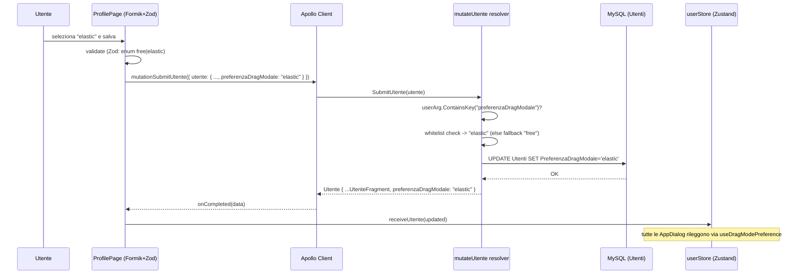
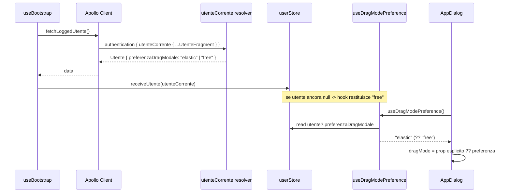

# Design: Preferenza per-utente per la modalita' di drag della modale (free/elastic)

## Technical Approach

Il change realizza l'**Approccio 1** della proposal: una nuova colonna scalare `PreferenzaDragModale`
sull'entita' `Utente`, esposta end-to-end tramite l'infrastruttura utente/profilo gia' esistente
(query `utenteCorrente`, mutation `mutateUtente`, `UtenteFragment`, `ProfilePage`, `userStore`), e
consumata in `AppDialog` al posto della costante hardcoded `DEFAULT_DRAG_MODE`.

Il flusso mappa 1:1 sui quattro strati:
1. **Persistenza EF Core** — property C# + config esplicita colonna in `AppDbContext` + migration
   `AddColumn` non-nullable con `defaultValue: "free"`.
2. **Schema GraphQL** — campo in `UtenteType` (output) e `UtenteInputType` (input), persistenza nella
   mutation `mutateUtente` in entrambi i rami (update + create) con validazione whitelist.
3. **Contratto TS/GraphQL condiviso** — campo aggiunto a `UtenteFragment` (propaga a query e mutation),
   al tipo dominio `Utente` e all'interfaccia `UtenteInput`.
4. **UI + consumo** — selettore in `ProfilePage` (Formik + Zod) e lettura in `AppDialog` tramite un hook
   dedicato `useDragModePreference` che legge `userStore` con fallback `"free"`.

Il valore fluisce dal DB fino ad `AppDialog` **senza nuovi endpoint**: il campo viaggia gia' col profilo
grazie a `UtenteFragment`, condiviso da `utenteCorrente` (letto al bootstrap) e da `mutateUtente`
(scritto dal profilo). Riferimento specs: scenari di persistenza round-trip, default utenti, fallback
utente non caricato, propagazione a tutte le modali.

## Architecture Decisions

### Decision: String + whitelist applicativa invece di enum GraphQL forte

**Choice**: modellare la preferenza come `string` C# (`PreferenzaDragModale`) con validazione whitelist
`{"free","elastic"}` a livello applicativo nella mutation, esposta come `StringGraphType` in input/output.

**Alternatives considered**:
- Enum C# `DragModePreference` + `EnumerationGraphType` GraphQL (type-safety a livello schema).
- Colonna con `CHECK constraint` a livello DB.

**Rationale**: il pattern del progetto usa costantemente `string` con validazione applicativa (es. lo
`status` del `CashRegister` DRAFT/CLOSED/RECONCILED e' gestito come stringa, non come enum GraphQL). La
mutation `mutateUtente` legge gli argomenti come `Dictionary<string, object>` (`AuthMutations.cs:143`):
un `EnumerationGraphType` richiederebbe conversione/parsing aggiuntivo del valore boxato, aumentando la
superficie di errore senza beneficio reale per due soli valori. La whitelist applicativa + fallback
`"free"` garantisce robustezza sufficiente (nessun valore fuori dominio raggiunge il client) con il
minor codice. Un `CHECK constraint` MySQL sarebbe rigido rispetto a future estensioni dell'insieme di
valori e fuori dallo stile del progetto (nessun altro campo lo usa).

### Decision: Hook dedicato `useDragModePreference` invece di leggere lo store direttamente in AppDialog

**Choice**: introdurre `useDragModePreference()` (in `duedgusto/src/components/common/dialog/`) che
incapsula `useStore((s) => s.utente?.preferenzaDragModale) ?? "free"` e restituisce un `DialogDragMode`.
`AppDialog` usa questo hook per calcolare il default del prop `dragMode`.

**Alternatives considered**:
- Leggere `useStore` inline dentro `AppDialog`.
- Far calcolare la preferenza a ciascuno dei 6 consumatori e passarla come prop esplicito.

**Rationale**: oggi `AppDialog` e' **puramente presentazionale** (nessuna dipendenza da store). Accoppiarlo
direttamente a Zustand romperebbe i test esistenti che montano le modali senza provider dello store e
disperderebbe la logica di fallback. L'hook centralizza in un unico punto: (a) la lettura dello store,
(b) il fallback `"free"` quando `utente` e' `null` (bootstrap/logout), (c) il tipo di ritorno. Nei test
delle modali si mocka un solo hook invece dello store globale. Far calcolare la preferenza ai 6
consumatori duplicherebbe la logica e vanificherebbe il vantaggio del default centralizzato (i
consumatori oggi non passano `dragMode`, quindi cambiare la sorgente del default li copre tutti).

**Nota di override**: il prop `dragMode` di `AppDialog` resta opzionale. Se un consumatore lo passa
esplicitamente, quel valore vince sulla preferenza utente (comportamento locale > preferenza globale).
Il default del prop diventa "preferenza utente" invece di `DEFAULT_DRAG_MODE`.

### Decision: Configurazione esplicita della colonna in AppDbContext

**Choice**: configurare la property in `AppDbContext.OnModelCreating` (blocco `Utente`, righe 58-73) con
`entity.Property(x => x.PreferenzaDragModale).IsRequired().HasMaxLength(20).HasDefaultValue("free");`.

**Alternatives considered**: mapping per convenzione (come gli altri scalari di `Utente`, oggi non
configurati esplicitamente), lasciando che EF deduca `longtext` nullable-by-CLR.

**Rationale**: la property C# `string` non-nullable mappa per convenzione a `NOT NULL`, ma senza
`HasMaxLength` MySQL genererebbe `longtext` (inadatto a un campo whitelist corto e non indicizzabile con
default inline). `HasDefaultValue("free")` fa in modo che la migration emetta `defaultValue: "free"` a
livello schema, cosi' gli utenti esistenti ereditano `"free"` senza backfill e insert che omettono il
campo restano validi. `HasMaxLength(20)` produce `varchar(20)`. Config esplicita = migration
deterministica e schema autodocumentante.

### Decision: Tipo condiviso `DragModePreference` come tipo globale ambient

**Choice**: definire `type DragModePreference = "free" | "elastic";` nel file ambient
`duedgusto/src/@types/Utente.d.ts` e riutilizzarlo per il campo `preferenzaDragModale` del tipo `Utente`,
per l'interfaccia `UtenteInput` e come alias di `DialogDragMode` in `AppDialog.tsx`.

**Alternatives considered**: mantenere `DialogDragMode` come sorgente in `AppDialog.tsx` e importarlo
altrove; oppure duplicare l'union in ogni file.

**Rationale**: `Utente.d.ts` e' gia' un file di tipi ambient globali del dominio; definirvi l'union la
rende disponibile ovunque senza import e senza rischio di dipendenza circolare (evita che il tipo dominio
`Utente` debba importare da un componente React di presentazione). `AppDialog` puo' aliasare
`export type DialogDragMode = DragModePreference;` mantenendo retrocompatibilita' del nome gia' usato dai
consumatori. Fonte di verita' unica per i valori ammessi lato client.

## Data Flow

```
[SCRITTURA — dal profilo]
ProfilePage (Formik) --preferenzaDragModale--> mutationSubmitUtente
        │                                             │
        ▼                                             ▼
   receiveUtente(updated)  <--UtenteFragment-- mutateUtente (whitelist+fallback)
        │                                             │
        ▼                                             ▼
    userStore                                  Utenti.PreferenzaDragModale (DB)

[LETTURA — al bootstrap e in ogni modale]
useBootstrap --utenteCorrente(UtenteFragment)--> receiveUtente --> userStore
                                                                      │
                                     useDragModePreference (?? "free")│
                                                                      ▼
                                                            AppDialog.dragMode
```

### Sequence diagram — Salvataggio preferenza dal profilo



### Sequence diagram — Lettura preferenza all'avvio e apertura modale



## File Changes

| File | Action | Description |
|------|--------|-------------|
| `backend/Models/Utente.cs` | Modify | Nuova property `public string PreferenzaDragModale { get; set; } = "free";` (non-nullable, default CLR `"free"`) |
| `backend/DataAccess/AppDbContext.cs` (blocco `Utente` 58-73) | Modify | `entity.Property(x => x.PreferenzaDragModale).IsRequired().HasMaxLength(20).HasDefaultValue("free");` |
| `backend/GraphQL/Authentication/Types/UtenteType.cs` | Modify | `Field(x => x.PreferenzaDragModale, typeof(StringGraphType));` |
| `backend/GraphQL/Authentication/Types/UtenteInputType.cs` | Modify | `Field<StringGraphType>("preferenzaDragModale");` (nullable in input: se omesso, fallback backend) |
| `backend/GraphQL/Authentication/AuthMutations.cs` (`mutateUtente` 150-196) | Modify | Persistere il campo nei rami **update** e **create** con `ContainsKey` + whitelist + fallback `"free"` |
| `backend/Migrations/<ts>_AddPreferenzaDragModaleToUtente.cs` | New | `AddColumn<string>("PreferenzaDragModale","Utenti", type:"varchar(20)", nullable:false, defaultValue:"free")` + `DropColumn` nel `Down` |
| `backend/Migrations/AppDbContextModelSnapshot.cs` | Modify (auto) | Rigenerato da `dotnet ef migrations add` |
| `backend/SeedData/SeedTestUser.cs` | Modify (eventuale) | Valorizzare `PreferenzaDragModale = "free"` nel seed (opzionale: il default CLR gia' copre) |
| `duedgusto/src/@types/Utente.d.ts` | Modify | `type DragModePreference = "free" \| "elastic";` + campo `preferenzaDragModale: DragModePreference` nel tipo `Utente` |
| `duedgusto/src/graphql/utente/fragment.tsx` | Modify | Aggiungere `preferenzaDragModale` a `UtenteFragment` (propaga a query + mutation) |
| `duedgusto/src/graphql/utente/mutations.tsx` | Modify | Campo `preferenzaDragModale: DragModePreference` nell'interfaccia `UtenteInput` |
| `duedgusto/src/components/pages/profile/ProfilePage.tsx` | Modify | Sezione "Preferenze": selettore `free`/`elastic` (Zod enum + Formik + variables mutation) |
| `duedgusto/src/components/common/dialog/useDragModePreference.tsx` | New | Hook: `useStore((s) => s.utente?.preferenzaDragModale) ?? "free"` |
| `duedgusto/src/components/common/dialog/AppDialog.tsx` | Modify | `DialogDragMode = DragModePreference`; default `dragMode` da `useDragModePreference()`; rimuovere/deprecare `DEFAULT_DRAG_MODE` come sorgente del default |
| `duedgusto/src/components/pages/profile/__tests__/ProfilePage.test.tsx` | Modify | Coprire selettore preferenza + variables mutation |
| `duedgusto/src/components/common/dialog/__tests__/` (eventuale) | New | Test hook `useDragModePreference` (fallback null → "free") |
| `backend/DuedGusto.Tests/Integration/GraphQL/` (nuovo file) | New | Test round-trip `mutateUtente` create+update e `utenteCorrente` sul nuovo campo |

## Interfaces / Contracts

### GraphQL schema (delta)

```graphql
type Utente {
  # ...campi esistenti...
  preferenzaDragModale: String   # "free" | "elastic"
}

input UtenteInput {
  # ...campi esistenti...
  preferenzaDragModale: String   # opzionale; se omesso o fuori whitelist -> "free"
}
```

### UtenteFragment (delta)

```graphql
fragment UtenteFragment on Utente {
  id
  nomeUtente
  nome
  cognome
  descrizione
  disabilitato
  ruoloId
  preferenzaDragModale          # <-- nuovo
  ruolo { ...RuoloFragment }
  menus { ...MenuFragment }
}
```

### Backend — logica whitelist in `mutateUtente` (entrambi i rami)

Aggiungere una costante/helper e applicarla in update (dopo riga 158) e create (dentro l'inizializzatore
di `newUser`, dopo riga 188):

```csharp
// helper (whitelist + fallback)
static readonly HashSet<string> DragModesAmmessi = new() { "free", "elastic" };
string ParseDragMode(Dictionary<string, object> arg) =>
    arg.ContainsKey("preferenzaDragModale")
    && arg["preferenzaDragModale"]?.ToString() is string v
    && DragModesAmmessi.Contains(v)
        ? v : "free";

// ramo update
existingUser.PreferenzaDragModale = ParseDragMode(userArg);

// ramo create (initializer)
PreferenzaDragModale = ParseDragMode(userArg),
```

> Gotcha critico (dalla proposal/exploration): il campo va aggiunto in **ENTRAMBI** i rami. In update la
> mancata assegnazione lascerebbe il valore precedente (bug silenzioso: il profilo "non salva"); in
> create l'omissione lascerebbe il default CLR `"free"` ma perderebbe la scelta esplicita alla creazione.

### Frontend — tipo dominio e Zod

```ts
// Utente.d.ts (ambient)
type DragModePreference = "free" | "elastic";

// ProfilePage — schema Zod
preferenzaDragModale: z.enum(["free", "elastic"]),
```

```ts
// useDragModePreference.tsx
function useDragModePreference(): DragModePreference {
  return useStore((state) => state.utente?.preferenzaDragModale) ?? "free";
}
```

### AppDialog (delta di contratto)

```tsx
export type DialogDragMode = DragModePreference; // alias retrocompatibile

function AppDialog({ /* ... */, dragMode }: AppDialogProps) {
  const preferenza = useDragModePreference();
  const effectiveDragMode = dragMode ?? preferenza; // prop esplicito vince
  // ...usa effectiveDragMode al posto dell'attuale default DEFAULT_DRAG_MODE
}
```

> Nota UI del selettore: nel progetto **non esiste** un `FormikSelect`/`FormikRadioGroup` riutilizzabile
> (in `src/components/common/form/` ci sono solo `FormikTextField`, `FormikCheckbox`,
> `FormikNumberField`, `FormikDateField`). Opzioni: (a) usare `RadioGroup`/`Select` MUI collegati
> manualmente a Formik dentro `ProfilePage` (piu' semplice, nessun nuovo componente condiviso), oppure
> (b) creare un piccolo `FormikSelect` riutilizzabile. Raccomandato **(a)** per contenere lo scope; la
> scelta e' rimandata alla fase tasks/apply. Etichette leggibili: `free` = "Resta dove la lasci",
> `elastic` = "Torna al centro".

## Testing Strategy

| Layer | What to Test | Approach |
|-------|-------------|----------|
| Unit (FE) | `useDragModePreference` restituisce la preferenza dallo store e fallback `"free"` con `utente` null | Vitest: mock `useStore` con/ senza `utente`; assert valore |
| Unit (FE) | `ProfilePage` mostra il selettore, ne cambia il valore e invia `preferenzaDragModale` nelle variables della mutation; validazione Zod enum | Estendere `ProfilePage.test.tsx` (gia' mocka `useMutation`, `useStore`, `useQueryLoggedUser`): interagire col selettore e asserire `mockMutate` chiamato con il campo |
| Unit (FE) | `AppDialog` usa la preferenza come default e rispetta il prop esplicito override | Mock di `useDragModePreference`; verificare comportamento `elastic` vs `free` (snap-back) |
| Integration (BE) | Round-trip `mutateUtente`: **create** con `preferenzaDragModale:"elastic"` persiste; **update** cambia il valore; omissione → `"free"`; valore fuori whitelist → `"free"` | Nuovo file in `backend/DuedGusto.Tests/Integration/GraphQL/` seguendo il pattern degli integration test esistenti (es. `SettingsTests.cs`, `SuppliersTests.cs`) |
| Integration (BE) | `utenteCorrente` restituisce `preferenzaDragModale` (fragment aggiornato) | Query `authentication { utenteCorrente { preferenzaDragModale } }` su utente seed |
| Regression | I test esistenti che montano modali (`AppDialog`) non si rompono per il nuovo accesso allo store | Verificare che il mock dell'hook copra i test dei 6 consumatori; eventuale `vi.mock` di `useDragModePreference` |
| Build/lint | `dotnet build`; `npm run ts:check`; `npm run lint` | CI gate come da `rules.verify` di config.yaml |

> Osservazione test esistenti: `ProfilePage.test.tsx` mocka gia' `useStore` come `vi.fn()` con
> `getState`. L'estensione deve fornire un `utente` con `preferenzaDragModale` e verificare le variables.
> Per `AppDialog`/consumatori conviene mockare `useDragModePreference` (superficie minima) invece di
> montare l'intero `userStore`.

## Migration / Rollout

**Migration richiesta: SI.** Nuova colonna non-nullable su `Utenti` (tabella potenzialmente popolata).

- Generazione: `cd backend && dotnet ef migrations add AddPreferenzaDragModaleToUtente`.
- Contenuto atteso (allineato al pattern `20260322141031_AddAliquotaIvaToFornitore.cs`):
  - `Up`: `AddColumn<string>(name:"PreferenzaDragModale", table:"Utenti", type:"varchar(20)", nullable:false, defaultValue:"free")`.
  - `Down`: `DropColumn(name:"PreferenzaDragModale", table:"Utenti")`.
- Applicazione: automatica all'avvio backend (`Program.cs` → `Database.MigrateAsync()`), come da
  `backend/CLAUDE.md`. `defaultValue: "free"` fa ereditare `"free"` agli utenti esistenti senza backfill;
  senza default MySQL fallirebbe su tabella non vuota (rischio noto della proposal).
- Ordine di deploy sicuro (change additivo e retrocompatibile): **backend prima** (colonna + campo
  GraphQL), **frontend dopo**. Un frontend vecchio ignora la colonna; un backend nuovo con frontend
  vecchio resta funzionante.
- Rollback: `dotnet ef migrations remove` se non applicata in produzione, altrimenti migration inversa
  `DropColumn`. La colonna e' droppabile senza perdita di dati identita' (vedi Rollback Plan della
  proposal).

## Open Questions

- [ ] Componente selettore: `RadioGroup`/`Select` MUI inline in `ProfilePage` (raccomandato, scope
      contenuto) vs nuovo `FormikSelect` riutilizzabile. Da decidere in fase tasks/apply.
- [ ] Aggiornare o meno `SeedTestUser.cs` esplicitamente: il default CLR `"free"` + `HasDefaultValue`
      gia' coprono; l'assegnazione esplicita e' solo cosmetica. Da confermare.
- [ ] `Utente.d.ts` attuale dichiara `descrizione`/`disabilitato` come non-nullable mentre l'entita' BE
      li ha nullable: incoerenza preesistente, fuori scope; il nuovo campo `preferenzaDragModale` e'
      sempre valorizzato (default `"free"`) quindi puo' essere non-nullable lato TS senza rischio.
