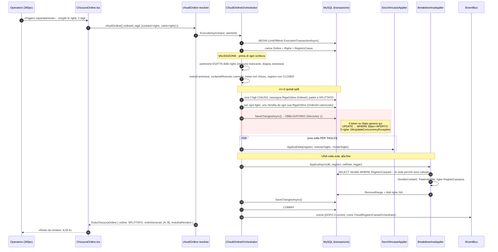
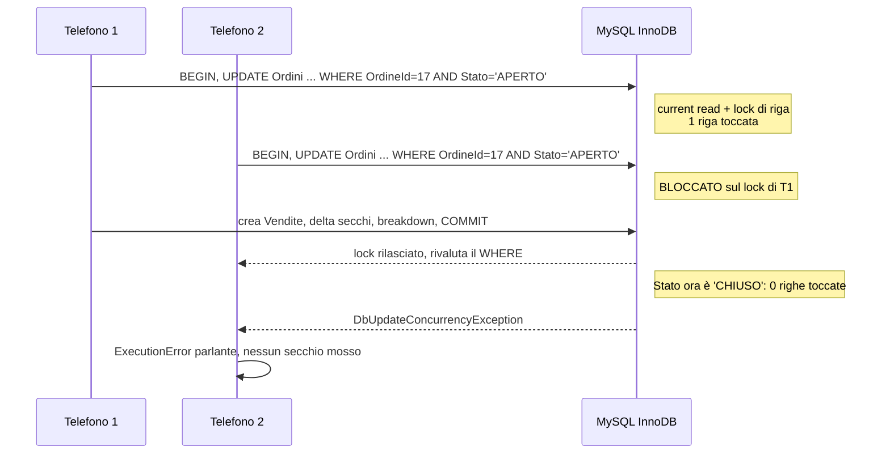

# Design: Ordini al punto vendita

## Technical Approach

Una sola frase governa tutto il change: **battere una consumazione non deve dichiarare dove vanno i
soldi.**

Oggi lo fa. `creaVendita` muove il secchio del registro nello stesso commit in cui nasce la riga
(`SecchiIncassiApplier.ApplicaDelta` + `BreakdownIvaApplier.ApplicaAsync` dentro `CreaVenditaAsync`),
e il metodo di pagamento si sceglie al secondo tocco — quando al bancone non è ancora noto. Il flusso
costringe quindi a indovinare e poi correggere, e la correzione passa da un'operazione **non
idempotente per costruzione**, dichiarata tale nel commento di `SecchiIncassiApplier.cs`.

La cura è spostare il momento della dichiarazione dalla riga all'ordine, e rendere la transizione
«ordine aperto → incassato» **l'unico punto del backend in cui nasce una `Vendita` e si muove un
secchio**. Non «il punto principale»: l'unico. Tutto il resto del design discende da qui.

Ordine di lavoro, dalla issue #24:

1. **C** — la voce «Vendita» a primo livello in sidebar. Indipendente, nessuna migrazione, si fa subito.
2. **A** — l'ordine. Il cambio strutturale.
3. **B** — i gruppi di prodotti e le varianti. Dipende da A.

---

## Architecture Decisions

### Decision: entità riga separata (`Ordine` + `RigaOrdine`), non uno stato su `Vendita`

**Scelta**: `Ordine` e `RigaOrdine` sono entità proprie. Le `Vendita` nascono **solo** dentro
`ChiudiOrdineOrchestrator`, alla transizione di chiusura.

**Alternativa considerata e scartata**: aggiungere a `Vendita` un campo `Stato`
(`BOZZA` / `CONFERMATA`) più un `OrdineId`, e filtrare `Stato == CONFERMATA` negli applier. Zero
tabelle nuove, migrazione più piccola, e il codice esistente di `creaVendita` resterebbe quasi intatto.

**Perché è stata scartata.** Sei ragioni, in ordine di peso.

**1. L'invariante «una `Vendita` esiste ⇒ è incassata» è portante, non decorativa.**
È ciò che permette a `BreakdownIvaApplier` di scrivere

```csharp
List<Vendita> vendite = await db.Vendite
    .Where(v => v.RegistroCassaId == registro.Id)
    .ToListAsync();
```

senza alcuna condizione sullo stato. Togliere l'invariante non elimina il requisito: lo **sposta** da
garanzia strutturale a disciplina che ogni lettore deve ricordare, per sempre.

**2. I lettori di `Vendite` sono già nove, e ne nasceranno altri.**
`BreakdownIvaApplier`, `IvaBreakdownCalculator`, `VenditeQueries.vendite`, `RicalcoloIvaStimaService`,
`RegistroCassaSyncService`, `SeedRicalcoloIvaVenditeStima`, la subscription `onVenditaCreated`,
`ScontrinoDelGiorno.tsx`, l'aggregazione della chiusura mensile. Un filtro dimenticato in **uno** di
questi è silenzioso: i totali si gonfiano e nessun controllo a valle se ne accorge. È esattamente la
classe di difetto che questo change esiste per rimuovere — sostituirla con una della stessa forma
sarebbe un pareggio travestito da progresso.

**3. L'alternativa non risparmia l'entità che pretende di risparmiare.**
Il requisito di stampa («identificativo stampabile, righe leggibili come gruppo», issue #24) impone
comunque un `OrdineId` su `Vendita` e una testata d'ordine da qualche parte. Si finirebbe con
l'entità ordine **più** una `Vendita` inquinata da uno stato che il 99% dei suoi lettori non deve
conoscere: si paga la tabella e non si compra l'invariante.

**4. Le due entità hanno contratti di mutabilità opposti.**
`RigaOrdine` è mutabile finché l'ordine è aperto: si aggiunge, si toglie, si cambia quantità, con
effetto contabile **zero**. `Vendita` nasce già immutabile per intenzione. Tenerle nella stessa
tabella significa che ogni scrittura deve prima chiedersi in quale metà del ciclo di vita si trova, e
la risposta starebbe in un campo invece che nel tipo.

**5. La transizione ha per soggetto l'ordine, non la riga.**
Con lo stato sulle righe, «chiudi» è un `UPDATE` su n righe che può riuscire a metà, lasciando un
ordine mezzo incassato che nessuna guardia sa più riconoscere. Con lo stato sulla testata è una riga
sola, e la guardia della decisione (c) diventa banale e verificabile.

**6. L'annullo di una riga in ordine aperto non genera delta perché non c'è codice di delta da
attraversare**, non perché un `if` lo salta. Un `if` dentro `eliminaVendita` sarebbe la seconda regola
sullo stesso campo: il difetto di partenza sotto altro nome.

**Prezzo accettato, dichiarato.** I campi snapshot (`Quantita`, `PrezzoUnitario`, `PrezzoTotale`,
`AliquotaIva`) esistono su `RigaOrdine` e vengono ricopiati su `Vendita` alla chiusura. È duplicazione
vera, ed è il costo onesto dell'invariante. Non si nasconde dietro una vista.

---

### Decision: il prezzo si congela quando la voce viene battuta, non alla chiusura

`RigaOrdine.PrezzoUnitario` e `RigaOrdine.AliquotaIva` sono uno snapshot preso **nel momento in cui la
voce entra nell'ordine**, non quando l'ordine si chiude.

**Motivazione**: è il prezzo detto al cliente. Un listino corretto a metà ordine non deve cambiare un
conto già annunciato al bancone, e il totale mostrato sul pannello dell'ordine dev'essere quello che
si pagherà. La `Vendita` eredita entrambi i valori dalla riga, quindi `RicalcolaImportiSnapshot` — che
scorpora l'IVA da `PrezzoTotale` con `IvaCalculator.ScorporaDaLordo` — non cambia semantica: è la
stessa funzione, applicata un momento dopo.

**Alternativa scartata**: leggere il prezzo corrente del prodotto alla chiusura. Renderebbe il totale
mostrato durante l'ordine una stima, e la differenza si scoprirebbe con il cliente davanti.

---

### Decision: `creaVendita` viene RIMOSSA dallo schema, non deprecata

**Scelta**:

- `creaVendita` **eliminata** da `VenditeMutations`. La creazione di `Vendita` diventa interna,
  invocabile solo da `ChiudiOrdineOrchestrator`.
- `aggiornaVendita` / `eliminaVendita` **ristrette**: restano nello schema ma rifiutano ogni `Vendita`
  con `OrdineId != null`, indicando `stornaOrdine`.

**Alternative considerate e scartate**:

| Alternativa | Perché scartata |
|---|---|
| Lasciarla deprecata ma funzionante | Finché il campo risponde, i due regimi convivono: uno che muove i secchi al momento della riga e uno che li muove alla chiusura. È il difetto per cui il change esiste, mantenuto in vita da un commento. **Una deprecazione non è una guardia.** |
| Restringerla per ruolo (solo admin) | Trasforma un problema strutturale in una questione di permessi e lascia vivo il percorso di codice che raggiunge il delta non idempotente. Peggio che togliere: dà l'impressione di aver chiuso. |
| Farla passare per l'ordine (crea ordine + chiudi in un colpo) | È una scorciatoia che salta lo stato `APERTO`, cioè salta esattamente il punto del change. E moltiplica i percorsi che arrivano alla chiusura, ognuno da sorvegliare. |

**Perché rimuovere costa zero, oggi e non domani.**
In produzione `Vendite` è **VUOTA**, e l'unico consumatore di `creaVendita` è
`PuntoVendita.tsx:handleConferma`, che questo change riscrive. Non c'è storico da proteggere né client
terzo da avvisare. È lo stesso ragionamento con cui la Fase 4 di #19 ha potuto aggiungere
`MetodoPagamento` senza inventare un valore di ripiego per lo storico: **è l'ultimo momento in cui
l'operazione è gratuita.**

**Perché `aggiornaVendita` / `eliminaVendita` sopravvivono con guardia invece di sparire.**
In sviluppo esistono righe nate prima degli ordini (`OrdineId is null`), e sono l'unico caso in cui
quelle due mutation hanno ancora un soggetto legittimo. Poiché **ogni nuova `Vendita` avrà `OrdineId`
valorizzato**, la guardia le chiude strutturalmente per tutti i dati futuri: non è disciplina, è
impossibilità. Vanno marcate come legacy con rimozione prevista una volta ripulito lo sviluppo.

```csharp
// In AggiornaVenditaAsync e EliminaVenditaAsync, subito dopo il caricamento.
if (sale.OrdineId is not null)
{
    throw new ExecutionError(
        $"Questa vendita appartiene all'ordine {sale.OrdineId} e non si corregge riga per riga: " +
        "usa stornaOrdine e ribatti. Correggerla qui muoverebbe i secchi una seconda volta.");
}
```

**Impatto sui test di autorizzazione**: nessuno.
`AutorizzazioneAnonimaTests.SchemaEspone_TuttiIRamiRootAttesi` enumera i **rami root**, non i campi,
quindi non cambia. Va **aggiunto** un test che pinna che `creaVendita` non esiste più nello schema:
altrimenti qualcuno la rimetterà per comodità e nulla lo segnalerà.

---

### Decision: `chiudiOrdine` è una sola mutation con i tagli in ingresso

**Scelta**: una mutation, `tagli: [TaglioOrdineInput!]!`. Un elemento = chiusura semplice; 2..n =
split. Il client non orchestra mai n chiusure.

**Alternativa scartata**: `chiudiOrdine` semplice + `splittaOrdine` separata, oppure n chiamate a
`chiudiOrdine` una per metodo, coordinate dal client.

**Perché è stata scartata.** n round-trip su un delta non idempotente sono **n occasioni di doppio
incasso**, e una chiamata che fallisce a metà lascia un ordine spaccato senza modo di ricomporlo: le
prime k righe hanno già mosso i secchi, le restanti no, e nessuno stato descrive quella situazione. La
issue lo dice esplicitamente: *«la transizione è "ordine aperto → n ordini chiusi", non n chiusure
indipendenti»*. Una transizione, una transazione, un commit.

**Contratto**:

```graphql
mutation { vendite { chiudiOrdine(input: ChiudiOrdineInput!): EsitoChiusuraOrdine! } }

input ChiudiOrdineInput {
  ordineId: Int!
  tagli: [TaglioOrdineInput!]!      # 1 = chiusura semplice · 2..n = split
}

input TaglioOrdineInput {
  metodoPagamento: String!           # validato con MetodiPagamentoVendita.IsAmmesso
  righeOrdineId: [Int!]!             # le righe che vanno in questo taglio
  contanteRicevuto: Decimal          # solo metodi in contanti; null = importo esatto
}

type EsitoChiusuraOrdine {
  ordine: Ordine!                    # CHIUSO (n=1) oppure SPLITTATO (n>=2)
  ordiniGenerati: [Ordine!]!         # vuoto se n=1, n figli CHIUSO se n>=2
  restoDaRendere: Decimal!           # somma di (contanteRicevuto - totale) sui tagli in contanti
}
```

---

### Decision: `ContanteRicevuto` / `RestoDaRendere` — mai `Resto`

**Scelta**: i due nomi nuovi sono `ContanteRicevuto` (input, persistito sull'ordine chiuso) e
`RestoDaRendere` (output, derivato e non persistito).

**Motivazione, dalla issue #24**: `RegistroCassa.Resto` **esiste già** ed è la **colonna AG** del
foglio, «Ecc al netto delle spese con scontrino». È un dato contabile della quadratura. Il resto dato
al cliente non c'entra nulla, non tocca alcun secchio, ed è un aiuto all'operatore. Riusare la parola
`Resto` creerebbe una confusione che poi non si toglie più — e la quadratura è il posto dove una
confusione costa di più.

**Perché `ContanteRicevuto` si persiste e `RestoDaRendere` no**: il primo è un fatto della transazione
e serve a ricostruire come è nato un errore («aveva dato 50, il totale era 12, il resto era 38»). Il
secondo è una sottrazione fra due numeri già presenti: persisterlo creerebbe una seconda fonte di
verità da tenere allineata, esattamente come `prezzoEffettivoVetrina`, che è un resolver derivato e
non una colonna.

**Guardie sul campo**:

- `contanteRicevuto` valorizzato con `metodoPagamento == ELETTRONICO` → **rifiuto**: non significa nulla.
- `contanteRicevuto < totale del taglio` → **rifiuto**: il cliente non ha coperto l'importo.
- `contanteRicevuto == null` → ammesso, significa «importo esatto, non serve il conto».

---

### Decision: la guardia della transizione è `IsConcurrencyToken()` su `Ordine.Stato`

**Scelta**:

```csharp
entity.Property(x => x.Stato)
    .HasMaxLength(20)
    .IsRequired()
    .IsConcurrencyToken();      // <-- la guardia
```

EF emette allora, dentro il `SaveChanges` che serve comunque, **esattamente** l'UPDATE condizionale
richiesto, e verifica lui le righe toccate:

```sql
UPDATE Ordini
   SET Stato = 'CHIUSO', MetodoPagamento = ?, TotaleOrdine = ?, ChiusoIl = ?, ChiusoDa = ?
 WHERE OrdineId = ? AND Stato = 'APERTO';
-- 0 righe toccate -> DbUpdateConcurrencyException
```

**Alternativa considerata**: `db.Database.ExecuteSqlInterpolatedAsync(...)` con controllo manuale di
`righeToccate == 1`.

**Perché è stata scartata.** Il SQL grezzo **scavalca il change tracker**: l'entità `Ordine` già
caricata nel `DbContext` resterebbe con lo `Stato` vecchio, e ogni lettura successiva dentro la stessa
unit of work mentirebbe. Servirebbe un `db.Entry(ordine).Reload()` esplicito subito dopo — che è
precisamente il tipo di passo che il prossimo bugfix dimentica, perché non ha sintomi finché non ne ha
di gravi. In più costa un round-trip aggiuntivo rispetto al `SaveChanges` che va fatto comunque.

Il token dà la **stessa** garanzia — stesso SQL, stessa verifica delle righe toccate — dentro
l'operazione che c'è già, senza uno stato duplicato fra database e memoria.

**Si applica identico a tutte e tre le transizioni**:

| Mutation | `WHERE` generato |
|---|---|
| `chiudiOrdine` | `AND Stato = 'APERTO'` |
| `annullaOrdine` | `AND Stato = 'APERTO'` |
| `stornaOrdine` | `AND Stato = 'CHIUSO'` |

**Traduzione dell'errore**: `DbUpdateConcurrencyException` non va propagata (diventerebbe un 500
opaco). Va catturata e trasformata in un `ExecutionError` parlante:

> «L'ordine 260828-017 non è più aperto: potrebbe essere già stato chiuso o annullato da un altro
> dispositivo. Ricarica gli ordini aperti.»

**Semantica MySQL su cui poggia il tutto — da non dare per scontata.**
Sotto `REPEATABLE READ` (il default di InnoDB) un `UPDATE` fa **current read**, non snapshot read:
legge l'ultima versione committata e prende il lock di riga. Una seconda `chiudiOrdine` concorrente si
blocca fino al commit della prima, poi rivaluta il `WHERE`, trova `Stato != 'APERTO'` e tocca 0 righe.
È questa serializzazione — non una `SELECT` fatta prima — che rende la transizione una-e-una-sola-volta.
L'istinto sbagliato è pensare che REPEATABLE READ faccia vedere al secondo UPDATE lo stato vecchio: per
le letture di scrittura non è così.

**🔴 Vincolo emerso applicando la Fase 2 — nessun token è popolato dal database.**
`rowversion` **non esiste su MySQL** (Pomelo non ha un tipo che si auto-incrementi a ogni UPDATE) **né
su Sqlite**, dove servirebbe un trigger scritto a mano. Un campo `RowVersion` valorizzato dal motore —
la forma che l'istinto suggerisce, e che il commento di
`TestDbContextFactorySqliteTests.cs:206` dà per in arrivo con questo change — **non è realizzabile su
nessuno dei due motori**: né quello di produzione né quello dei test. Qualunque forma prenda la
guardia, **il valore su cui si confronta lo scrive l'applicazione**.

Il vincolo non sposta la conclusione — la transizione resta una-e-una-sola-volta — ma lasciava aperta
la forma. Le strade erano due, **entrambe già provate eseguibili su Sqlite** dai test della Fase 2:

| Forma | Chi scrive il valore | Prova già in casa |
|---|---|---|
| **Token di concorrenza gestito dall'applicazione** — è `Ordine.Stato` con `IsConcurrencyToken()`, la forma proposta sopra: il token *è* lo stato, e a scriverlo è il codice della transizione. Nessun campo tecnico in più | l'orchestratore assegna `Stato`; EF confronta il valore originale letto | `Sqlite_OnoraIlTokenDiConcorrenza_IlSecondoScrittoreVieneRifiutato` |
| **Guardia sul solo `WHERE Stato = 'APERTO'` con conteggio delle righe toccate** (`ExecuteUpdateAsync`): 1 = la transizione è mia, 0 = qualcun altro è già passato di qui | nessun token: la condizione è lo stato atteso, scritto nella query | `CreateSqlite_UpdateCondizionata_ToccaUnaRigaLaPrimaVoltaEZeroLaSeconda` |

**✅ SCELTA DELLA FASE 5 — il token su `Ordine.Stato`.** Il codice sta in
`backend/GraphQL/Vendite/TransizioneOrdine.cs`, che è il punto unico da cui passano tutte e tre le
transizioni. Le quattro ragioni, in ordine di peso:

1. **Il confronto avviene dentro un `SaveChanges` che serve comunque.** La transizione non scrive
   soltanto lo stato: scrive anche `MetodoPagamento`, `TotaleOrdine`, `ChiusoIl`, `ChiusoDa`, crea le
   `Vendita` e — nello split — i figli e la riassegnazione delle righe. Con il token, quella UPDATE
   porta da sé `AND Stato = 'APERTO'`. Con `ExecuteUpdateAsync` ci sarebbero **due scritture sulla
   stessa riga** nella stessa transazione, e le assegnazioni degli altri campi finirebbero dentro una
   lambda lontana dall'entità.
2. **Non scavalca il change tracker.** `ExecuteUpdateAsync` lascerebbe l'`Ordine` già caricato con lo
   stato vecchio: l'oggetto restituito al client direbbe `APERTO` su un ordine appena chiuso, finché
   qualcuno non aggiunge un `Reload()`. È il passo che il prossimo bugfix dimentica, perché non ha
   sintomi finché non ne ha di gravi.
3. **Gira su entrambi i provider.** `ExecuteUpdateAsync` non è supportata da InMemory — pinnato da un
   test della Fase 2 — quindi i test della guardia girerebbero solo su Sqlite. Il pezzo più critico
   del change è quello che merita meno di essere legato a un provider solo. *(In pratica i test della
   guardia stanno comunque su Sqlite, perché serve un secondo contesto sullo stesso database; ma la
   possibilità resta aperta e il resto della macchina a stati è verificabile ovunque.)*
4. **Il `WHERE` è generato, non digitato.** Con `ExecuteUpdateAsync` lo stato atteso andrebbe ripetuto
   a mano in ognuna delle tre transizioni, dove può divergere da quello che il codice crede di aver
   letto. Con il token viene dal valore **effettivamente letto**.

**Costo accettato**: la diagnosi arriva come `DbUpdateConcurrencyException` e non come un conteggio di
righe, quindi va tradotta — lo fa `TransizioneOrdine.SalvaTransizioneAsync`, e propagarla sarebbe un
500 opaco. In cambio, il `SaveChanges` della transizione va tenuto **stretto**: tutto ciò che vi entra
condivide la stessa diagnosi.

⚠️ **Fatto misurato in Fase 5, da sapere**: togliere `.IsConcurrencyToken()` **non** rende rosso
`MigrazioniAllineateAlModelloTests` — `IMigrationsModelDiffer` non produce operazioni per un'annotazione
che non cambia il DDL. La rete che protegge il token è il test
`DueChiusureConcorrenti_UnaSolaVinceEIlSecchioSiMuoveUnaVolta`, provato rosso rimuovendo l'annotazione,
non la coerenza con le migrazioni.

⚠️ **Chi legge questo file più avanti non deve dare per scontato un token popolato dal database**: non
esiste, su nessuno dei due motori. Il valore lo scrive l'applicazione, ed è lo stato.

---

### Decision: lo split produce uno stato `SPLITTATO`, il padre non diventa un taglio

**Scelta**: con n ≥ 2 tagli, l'ordine origine passa a `SPLITTATO` (terminale, non incassato, non tocca
alcun secchio) e nascono n **figli** `CHIUSO`, ognuno con il proprio metodo, le proprie righe
(riassegnate) e il proprio suffisso stampabile.

**Alternative considerate**:

| Alternativa | Perché scartata |
|---|---|
| Il padre chiude come **primo taglio**, n−1 fratelli nascono accanto | Il padre porterebbe un metodo con cui non ha incassato il proprio importo: «ordine 017, chiuso, 12 €» quando ne aveva battuti 30. È una riga che mente in ogni elenco e in ogni report. |
| Le righe restano sul padre, i figli le referenziano via tabella di collegamento | Aggiunge una terza tabella e una seconda fonte di verità su «di chi è questa riga». Il join in più si paga a ogni lettura per un beneficio nullo. |
| Nessuno stato nuovo: n figli e il padre `ANNULLATO` | `ANNULLATO` significa «non ha mai incassato nulla ed è stato cancellato». Un ordine spaccato ha incassato tutto, tramite i figli. Riusare lo stato riempirebbe di ordini regolari l'elenco degli annullati, che è un elenco di controllo. |

**Costo**: uno stato in più. **Beneficio**: l'elenco si legge da solo — «017, spaccato in 017-A
(contanti) e 017-B (carta)» — e **nessun ordine porta mai un metodo con cui non ha incassato il
proprio intero importo**.

**Righe riassegnate ai figli, non duplicate**: `RigaOrdine.OrdineId` passa al figlio. Il padre si legge
attraverso `Figli.SelectMany(f => f.Righe)`, che è anche il modo in cui un conto diviso si legge nella
realtà. Il gruppo stampabile diventa il figlio, cioè quello che si consegna al cliente.

---

### Decision: `stornaOrdine` CANCELLA le `Vendita`, non le marca

**Scelta**: lo storno elimina le `Vendita` dell'ordine. La tracciabilità vive sull'`Ordine`
(`STORNATO`, `StornatoDa`, `StornatoIl`, `MotivoStorno`) e sulle sue `RigaOrdine`, che **non si
cancellano mai**.

**Alternativa scartata**: marcare le `Vendita` con un flag `Stornata = true` e lasciarle in tabella.

**Perché è stata scartata — ed è la stessa ragione della decisione (a), vista da un'altra angolazione.**
`BreakdownIvaApplier` ricalcola `VenditeContanti` e il breakdown IVA dalla **somma delle `Vendita`
persistite**:

```csharp
registro.VenditeContanti = vendite.Sum(v => v.PrezzoTotale);
```

Se le vendite stornate restassero in tabella, quella somma continuerebbe a contarle, e servirebbe un
`Where(v => !v.Stornata)`. Cioè: **lo stato su `Vendita` più il filtro negli applier** — l'alternativa
scartata nella decisione (a), rientrata dalla finestra, e per giunta su un percorso meno battuto,
quindi con meno probabilità che qualcuno se ne accorga.

Cancellare tiene l'invariante: **una `Vendita` che esiste è una riga incassata adesso**. Il libro
mastro è l'`Ordine`, che conserva tutto.

**Corollario**: `stornaOrdine` su un ordine `SPLITTATO` si **rifiuta**. Si stornano i figli, uno per
uno. Altrimenti un gesto applicherebbe n delta inversi e il ragionamento «una volta sola» diventerebbe
n ragionamenti da tenere insieme.

---

### Decision: `annullaOrdine` è tracciato ma NON amministrativo; `stornaOrdine` sì

**Scelta**:

| Gesto | Ruolo richiesto | Traccia obbligatoria |
|---|---|---|
| `annullaOrdine` (ordine aperto) | nessuno, chiunque venda | `MotivoAnnullamento` non vuoto, `AnnullatoDa`, `AnnullatoIl` |
| `stornaOrdine` (ordine chiuso) | **amministratore** (`GestioneCassaGuards.GuardUtenteAmministratore`) | `MotivoStorno` non vuoto, `StornatoDa`, `StornatoIl` |

**Motivazione.** La issue è esplicita: se cancellare un ordine è il modo per sbloccare la chiusura di
cassa, è anche il modo per far sparire un incasso reale, e *«un controllo con una scappatoia
silenziosa non controlla niente»*. La risposta però è **tracciare, non restringere**: un annullo
riservato all'amministratore spingerebbe l'operatore a non chiudere affatto gli ordini, che è peggio
del rischio che evita. Un ordine annullato non sparisce, passa allo stato e resta consultabile con chi
e quando.

Lo storno invece è l'operazione ad alto rischio — delta inverso su un'operazione non idempotente — e
l'helper amministratore esiste già, usato dalla libreria media.

---

### Decision: nessun ramo GraphQL root nuovo

**Scelta**: tutti i campi nuovi stanno sotto i tipi **esistenti** `VenditeMutations` /
`VenditeQueries`. Nessun `Field<OrdiniMutations>("ordini")` alla radice.

**Motivazione — è una decisione di sicurezza, non di ergonomia.**
L'endpoint `/graphql` è montato con `AuthorizationRequired = false` (`Program.cs`): la protezione è
**interamente per campo**, quindi un modulo che nasce senza `this.Authorize()` è **pubblico per
default**. È già successo: `AuthMutations` esponeva `mutateUtente` in anonimo, permettendo di
riscrivere Hash e Salt del superadmin e poi accedere da `/api/auth/signin`.

Restando sotto `vendite` — che chiama già `this.Authorize()` a livello di tipo — i campi nuovi sono
coperti dal primo giorno, i tre `Theory` di `AutorizzazioneAnonimaTests` continuano a coprirli senza
modifiche, e `SchemaEspone_TuttiIRamiRootAttesi` non cambia. Un ramo nuovo sarebbe protetto solo se
qualcuno si ricordasse di proteggerlo, e la dimenticanza non ha sintomi.

Beneficio collaterale: il client conserva la forma `mutation { vendite { ... } }` già cablata.

---

### Decision: le mutation di riga non toccano MAI gli applier

`aggiungiRigaOrdine`, `aggiornaRigaOrdine`, `rimuoviRigaOrdine` non invocano né `SecchiIncassiApplier`
né `BreakdownIvaApplier`.

**Motivazione**: non c'è nulla da disfare perché non c'era nulla da fare. È il vincolo della issue
(*«l'annullo di una riga in ordine aperto non deve generare delta»*) reso **strutturale invece che
condizionale**: non esiste un ramo di codice che decide di saltare il delta, esiste un percorso che il
delta non lo attraversa proprio.

---

### Decision: gruppi molti-a-molti con entità di join esplicita

**Scelta**: `GruppoProdotti` + `ProdottoGruppo` (join esplicita con payload), non
`UsingEntity<Dictionary<string, object>>`.

**Alternativa scartata**: il pattern di `RuoloMenu` in `AppDbContext.cs:107`, che usa un dizionario
anonimo. Scartata perché l'appartenenza **porta un dato proprio** (`Ordinamento`, vedi sotto) e il
dizionario non lo regge in modo leggibile né tipizzato.

**Le tre domande lasciate aperte dalla issue, chiuse qui**:

**1. Un prodotto può stare in più gruppi?** → **Sì, molti-a-molti.** ✅ **Confermato dall'utente**, col
criterio «più gruppi *se non è complicato*, altrimenti uno solo».
L'utente ha chiesto «raggruppamento libero, gestito dall'utente». Un 1:N costringerebbe a scegliere fra
«Spritz» e un futuro «Analcolici» per la stessa voce, e la scelta si scoprirebbe sbagliata il giorno
dopo. Il gruppo è un livello **sopra** i prodotti, indipendente da categoria e prezzo: deve poter
tagliare trasversalmente anche sé stesso.

**Perché «non è complicato» qui è un fatto verificato e non una speranza** — è la parte che il criterio
dell'utente chiede di provare:

| Cosa servirebbe | Esiste già in questo progetto |
|---|---|
| Uno schema molti-a-molti EF Core | `Ruolo` ↔ `Menu`, `AppDbContext.cs:104-118` (join `RuoloMenu`) |
| Una **join esplicita con payload** — è il caso di `ProdottoGruppo`, che porta `Ordinamento` | `backend/Models/RegistroCassaMensile.cs`: chiave composita `{ChiusuraId, RegistroId}` + payload `Incluso`, configurata in `AppDbContext.cs:~1318-1341`. **Stessa identica forma** |
| Una pagina che assegna un molti-a-molti | `duedgusto/src/components/pages/roles/RoleDetails.tsx` + `RoleMenus.tsx`, AG Grid a selezione multipla |
| Un seed che popola la relazione senza duplicare | `SeedMenus.AssegnaRuoli`, additivo |

L'unico costo effettivo è la query «prodotti non raggruppati» della griglia principale, che diventa
`!p.Gruppi.Any()` invece di `p.GruppoId == null`: un'anti-join su ~147 righe **già interamente in
cache**. E il costo dell'errore è asimmetrico, che è ciò che decide un caso in bilico: da 1:N a N:N si
passa solo con una **migrazione con dati dentro**, mentre un N:N usato con un solo gruppo per prodotto
si comporta esattamente come un 1:N. Sbagliare verso il molti-a-molti si corregge da sé; sbagliare
verso l'1:N no.

**2. Prezzo indicativo sul tastone del gruppo?** → **«da X €», derivato da `Min(prezzo dei membri
attivi)`, mai persistito.**
Un prezzo indicativo salvato invecchia **in silenzio** il giorno in cui un membro cambia listino, ed è
il tipo di bugia che nessuno va a verificare. Quando tutti i membri costano uguale si mostra il prezzo
nudo, senza «da»: il «da» su un prezzo unico è rumore.

**3. Ordine dei prodotti dentro il gruppo?** → **Manuale (`ProdottoGruppo.Ordinamento`), pareggio su
`Prodotto.Codice`.**
È la stessa ragione per cui `coloriProdotto.indiciPerCategoria` calcola gli indici sul listino
**intero** e non su quello filtrato: la mano impara la posizione, e un colore o una posizione che si
muovono sono peggio di nessun colore e nessun ordine. Un ordinamento automatico per prezzo
rimescolerebbe la griglia al primo aggiornamento di listino.

---

### Decision: il colore esplicito sta su `Prodotto`, non sull'appartenenza al gruppo

**Scelta**: `Prodotto.Colore` (`varchar(20)`, formato `#RRGGBB`, nullable). `GruppoProdotti.Colore`
esiste a parte, per il tastone del gruppo nella griglia principale. **Nessun colore sulla riga di join.**

**Alternativa scartata**: `ProdottoGruppo.Colore`, cioè il colore come proprietà dell'appartenenza.

**Perché è stata scartata.** Il colore chiesto dalla issue — Liscio bianco, Aperol arancione, Campari
rosso, Cynar viola — è il colore **della bevanda**. È una proprietà del prodotto, e lo stesso Aperol
dev'essere arancione in qualunque gruppo compaia. Metterlo sull'appartenenza aprirebbe la possibilità
che lo stesso articolo sia arancione in un gruppo e verde in un altro: uno stato incoerente che nulla
impedisce e nessuno vuole.

**Come si integra col generato, senza scavalcarlo.**
`coloriProdotto.tsx` produce `{ sfondo, banda }` e i due livelli di luminosità dipendono dal tema
(`LIVELLI_SFONDO_CHIARO` / `LIVELLI_SFONDO_SCURO`). Un `#RRGGBB` usato **tal quale** come `sfondo`
sbaglia contrasto: «Spritz liscio», dichiarato bianco, sparisce in tema chiaro; il viola del Cynar
diventa illeggibile in scuro.

Il colore dichiarato va quindi trattato come **tinta**, non come valore finale: se ne prendono tonalità
e saturazione e si applicano le **stesse** fasce di luminosità del generato. Così esplicito e generato
convivono nella stessa griglia senza che si veda la cucitura, e il tema scuro continua a funzionare
senza una seconda tabella di colori.

**Firma retrocompatibile** — quarto parametro opzionale, così il test esistente resta verde:

```ts
export function coloreProdotto(
  categoria: string | null | undefined,
  indice: number,
  modo: ModoTema,
  coloreEsplicito?: string | null      // vince sul generato quando valorizzato
): ColoreProdotto
```

---

## Data Model — EF Core

### Nuova entità `Ordine`

```csharp
public class Ordine
{
    public int OrdineId { get; set; }

    /// <summary>
    /// ⚠️ FISSATO all'apertura e MAI ricalcolato alla chiusura. Decisione della issue #24:
    /// «Ordine a cavallo di mezzanotte: non si gestisce. Finché la cassa non si chiude, tutto
    /// resta nel giorno di apertura.» Un ordine aperto alle 23:50 e chiuso alle 00:20 incassa
    /// sul registro di IERI, ed è voluto.
    /// </summary>
    public int RegistroCassaId { get; set; }

    /// <summary>Progressivo PER REGISTRO. Vedi l'indice unico: senza, la collisione è muta.</summary>
    public int Numero { get; set; }

    /// <summary>
    /// 'A', 'B', … sui figli di uno split; stringa VUOTA su tutti gli altri.
    /// 🔴 NOT NULL con default `string.Empty`, e non è una svista da «semplificare» a `string?`:
    /// in MySQL come in Sqlite più NULL sono considerati DISTINTI dentro un indice unico. Con la
    /// colonna nullable la terna (RegistroCassaId, Numero, NULL) sarebbe duplicabile in silenzio,
    /// cioè l'indice unico qui sotto smetterebbe di proteggere proprio il caso normale — l'ordine
    /// non splittato, che è la quasi totalità. Sarebbe la Discovery 6 rientrata dalla porta di
    /// servizio: due ordini con lo stesso numero stampato.
    /// </summary>
    public string SuffissoSplit { get; set; } = string.Empty;

    /// <summary>
    /// APERTO | CHIUSO | ANNULLATO | SPLITTATO | STORNATO.
    /// 🔴 È un TOKEN DI CONCORRENZA: è questo campo a rendere la transizione
    /// una-e-una-sola-volta. Vedi la configurazione EF.
    /// </summary>
    public string Stato { get; set; } = StatiOrdine.Aperto;

    /// <summary>Valorizzato solo dagli ordini CHIUSO. Uno dei MetodiPagamentoVendita.</summary>
    public string? MetodoPagamento { get; set; }

    /// <summary>
    /// Snapshot di Σ righe scritto ALLA CHIUSURA. Unico scrittore: ChiudiOrdineOrchestrator.
    /// Mentre l'ordine è APERTO vale 0 e il totale si deriva dalle righe.
    /// </summary>
    public decimal TotaleOrdine { get; set; }

    /// <summary>
    /// Quanto ha dato il cliente in contanti. ⚠️ NON è RegistroCassa.Resto (colonna AG del
    /// foglio): non tocca alcun secchio, non entra in alcuna quadratura, è un aiuto
    /// all'operatore. Il resto da rendere si deriva, non si salva.
    /// </summary>
    public decimal? ContanteRicevuto { get; set; }

    public int? OrdinePadreId { get; set; }      // self-FK, solo sui figli di split

    public int? ApertoDa { get; set; }
    public DateTime ApertoIl { get; set; } = DateTime.UtcNow;
    public int? ChiusoDa { get; set; }
    public DateTime? ChiusoIl { get; set; }
    public int? AnnullatoDa { get; set; }
    public DateTime? AnnullatoIl { get; set; }
    public string? MotivoAnnullamento { get; set; }
    public int? StornatoDa { get; set; }
    public DateTime? StornatoIl { get; set; }
    public string? MotivoStorno { get; set; }

    public string? Note { get; set; }
    public DateTime CreatedAt { get; set; } = DateTime.UtcNow;
    public DateTime UpdatedAt { get; set; } = DateTime.UtcNow;

    public RegistroCassa RegistroCassa { get; set; } = null!;
    public Ordine? OrdinePadre { get; set; }
    public ICollection<Ordine> Figli { get; set; } = [];
    public ICollection<RigaOrdine> Righe { get; set; } = [];
    public ICollection<Vendita> Vendite { get; set; } = [];
}
```

**Identificativo stampabile**: `{Data:yyMMdd}-{Numero:D3}[-{SuffissoSplit}]` → `260828-017-A`.
Il segmento del suffisso compare quando `SuffissoSplit` **non è vuoto** — non «quando non è null»: la
colonna è NOT NULL e vale `""` su ogni ordine non splittato.
Derivato in lettura, mai persistito (stesso criterio di `prezzoEffettivoVetrina`). Un ticket stampato
con `260828-017` mentre l'ordine era aperto resta rintracciabile anche dopo lo split: il padre esiste
ancora e punta ai figli.

### Nuova entità `RigaOrdine`

```csharp
public class RigaOrdine
{
    public int RigaOrdineId { get; set; }
    public int OrdineId { get; set; }
    public int ProdottoId { get; set; }

    /// <summary>⚠️ decimal e non int, come Vendita.Quantita.</summary>
    public decimal Quantita { get; set; }

    /// <summary>Congelato quando la voce viene battuta: è il prezzo detto al cliente.</summary>
    public decimal PrezzoUnitario { get; set; }

    /// <summary>Snapshot, come su Vendita. La Vendita lo eredita alla chiusura.</summary>
    public decimal AliquotaIva { get; set; }

    public decimal PrezzoTotale { get; set; }
    public string? Note { get; set; }
    public DateTime DataOra { get; set; } = DateTime.UtcNow;
    public DateTime CreatedAt { get; set; } = DateTime.UtcNow;
    public DateTime UpdatedAt { get; set; } = DateTime.UtcNow;

    public Ordine Ordine { get; set; } = null!;
    public Prodotto Prodotto { get; set; } = null!;
}
```

⚠️ `RigaOrdine` **non** porta `Imponibile` / `ImportoIva`: lo scorporo IVA è un fatto della vendita
incassata e resta su `Vendita`, calcolato da `RicalcolaImportiSnapshot` alla chiusura. Duplicarlo sulla
riga creerebbe due luoghi dove l'invariante `Imponibile + ImportoIva == PrezzoTotale` può divergere.

### Nuove entità dei gruppi

```csharp
public class GruppoProdotti
{
    public int GruppoProdottiId { get; set; }
    public string Codice { get; set; } = string.Empty;   // UNIQUE, convenzione D2
    public string Nome { get; set; } = string.Empty;     // "Spritz"
    public string? Colore { get; set; }                  // #RRGGBB, tastone del gruppo
    public int Ordinamento { get; set; }
    public bool Attivo { get; set; } = true;             // si disattiva, non si cancella
    public DateTime CreatedAt { get; set; } = DateTime.UtcNow;
    public DateTime UpdatedAt { get; set; } = DateTime.UtcNow;

    public ICollection<ProdottoGruppo> Membri { get; set; } = [];
}

public class ProdottoGruppo
{
    public int GruppoProdottiId { get; set; }
    public int ProdottoId { get; set; }

    /// <summary>Ordine MANUALE dentro il gruppo. Pareggio su Prodotto.Codice.</summary>
    public int Ordinamento { get; set; }

    public GruppoProdotti Gruppo { get; set; } = null!;
    public Prodotto Prodotto { get; set; } = null!;
}
```

`Attivo` e non una cancellazione: stesso vincolo dei prodotti — non esiste `eliminaGruppoProdotti` per
la stessa ragione per cui non esiste `eliminaProdotto`.

### Modifiche a entità esistenti

| Entità | Campo | Tipo | Note |
|---|---|---|---|
| `Vendita` | `OrdineId` | `int?` | FK → `Ordini`, `OnDelete(Restrict)`, indicizzato. **Nullable solo per le righe di sviluppo nate prima degli ordini**: in produzione (`Vendite` vuota) è di fatto obbligatorio dal primo giorno. È il campo su cui poggia la guardia della decisione (b). |
| `Vendita` | `Ordine` | `Ordine?` | navigazione |
| `Prodotto` | `Colore` | `string?` | `varchar(20)`, `#RRGGBB`, validato lato server con messaggio parlante come l'aliquota in `UpsertProdottoAsync` |
| `Prodotto` | `Gruppi` | `ICollection<ProdottoGruppo>` | navigazione inversa |

⚠️ `Colore` **deve** essere aggiunto a `ProdottoInput` e a `ProdottoType`: è un campo di **cassa**, non
di vetrina. Il confine pinnato da `ConfineVetrinaCassaTests` riguarda i campi **vetrina**
(`VisibileSulSito`, `NomeVetrina`, `PrezzoVetrina`, …), che non devono mai entrare in `ProdottoInput`
perché `UpsertProdottoAsync` fa assegnazione totale e li azzererebbe in massa. `Colore` sta dall'altra
parte del confine e va scritto dalla pagina Prodotti.

### Configurazione EF (`AppDbContext.OnModelCreating`)

```csharp
modelBuilder.Entity<Ordine>(entity =>
{
    entity.ToTable("Ordini").HasCharSet("utf8mb4").UseCollation("utf8mb4_unicode_ci")
          .HasKey(x => x.OrdineId);
    entity.Property(x => x.OrdineId).ValueGeneratedOnAdd();

    // 🔴 LA GUARDIA. Con questo, ogni UPDATE su un Ordine porta in coda
    //    "AND Stato = <valore letto>", ed EF lancia DbUpdateConcurrencyException se tocca
    //    0 righe. È ciò che rende la chiusura una-e-una-sola-volta senza SQL grezzo e
    //    senza il Reload() che il SQL grezzo imporrebbe.
    //    ⚠️ Il token è lo STATO, scritto dall'applicazione: non c'è (e non può esserci) un
    //    RowVersion popolato dal database — né MySQL né Sqlite lo generano. La forma
    //    alternativa — WHERE Stato='APERTO' con conteggio delle righe toccate — resta una
    //    scelta aperta della Fase 5. Vedi §«la guardia della transizione».
    entity.Property(x => x.Stato)
          .HasMaxLength(20).IsRequired()
          .HasDefaultValue(StatiOrdine.Aperto)
          .IsConcurrencyToken();

    // ⚠️ NON nullable, ed è ciò che rende utile l'indice unico più sotto: in MySQL come in
    //    Sqlite più NULL sono DISTINTI dentro un indice unico, quindi con la colonna nullable la
    //    terna (RegistroCassaId, Numero, NULL) — cioè il caso normale, l'ordine non splittato —
    //    sarebbe duplicabile in silenzio. Con NOT NULL DEFAULT '' la stringa vuota entra nella
    //    chiave e il duplicato viene rifiutato. Vuoto se non splittato, "A"/"B"/… sui figli.
    entity.Property(x => x.SuffissoSplit)
          .HasMaxLength(2).IsRequired().HasDefaultValue(string.Empty);

    entity.Property(x => x.MetodoPagamento).HasMaxLength(30);
    entity.Property(x => x.TotaleOrdine).HasColumnType("decimal(10,2)").HasDefaultValue(0m);
    entity.Property(x => x.ContanteRicevuto).HasColumnType("decimal(10,2)");
    entity.Property(x => x.MotivoAnnullamento).HasColumnType("text");
    entity.Property(x => x.MotivoStorno).HasColumnType("text");
    entity.Property(x => x.Note).HasColumnType("text");
    entity.Property(x => x.CreatedAt).HasColumnType("datetime")
          .HasDefaultValueSql("CURRENT_TIMESTAMP");
    entity.Property(x => x.UpdatedAt).HasColumnType("datetime")
          .HasDefaultValueSql("CURRENT_TIMESTAMP ON UPDATE CURRENT_TIMESTAMP");

    entity.HasOne(x => x.RegistroCassa).WithMany()
          .HasForeignKey(x => x.RegistroCassaId).OnDelete(DeleteBehavior.Restrict);

    // Restrict e non Cascade: cancellare un padre non deve far sparire i figli chiusi, che
    // hanno mosso i secchi. Il padre non si cancella comunque — passa a SPLITTATO.
    entity.HasOne(x => x.OrdinePadre).WithMany(x => x.Figli)
          .HasForeignKey(x => x.OrdinePadreId).OnDelete(DeleteBehavior.Restrict);

    // 🔴 L'indice che trasforma una corsa silenziosa in un errore rumoroso. Vedi Discovery 6.
    //    Regge SOLO perché SuffissoSplit è NOT NULL: con la colonna nullable la terna del caso
    //    normale sarebbe (registro, numero, NULL), e più NULL non collidono mai fra loro.
    entity.HasIndex(x => new { x.RegistroCassaId, x.Numero, x.SuffissoSplit }).IsUnique();

    // Serve alla guardia della chiusura cassa e all'elenco degli ordini aperti.
    entity.HasIndex(x => new { x.RegistroCassaId, x.Stato });
});

modelBuilder.Entity<RigaOrdine>(entity =>
{
    entity.ToTable("RigheOrdine").HasCharSet("utf8mb4").UseCollation("utf8mb4_unicode_ci")
          .HasKey(x => x.RigaOrdineId);
    entity.Property(x => x.RigaOrdineId).ValueGeneratedOnAdd();
    entity.Property(x => x.Quantita).HasColumnType("decimal(10,2)").IsRequired();
    entity.Property(x => x.PrezzoUnitario).HasColumnType("decimal(10,2)").IsRequired();
    entity.Property(x => x.PrezzoTotale).HasColumnType("decimal(10,2)").IsRequired();
    entity.Property(x => x.AliquotaIva).HasColumnType("decimal(5,2)").IsRequired()
          .HasDefaultValue(10.00m);
    entity.Property(x => x.Note).HasColumnType("text");
    entity.Property(x => x.DataOra).HasColumnType("datetime").IsRequired();

    // Cascade: le righe di un ordine cancellato a database non hanno vita propria.
    entity.HasOne(x => x.Ordine).WithMany(x => x.Righe)
          .HasForeignKey(x => x.OrdineId).OnDelete(DeleteBehavior.Cascade);

    // Restrict come Vendita → Prodotto: un prodotto usato in un ordine non si cancella.
    entity.HasOne(x => x.Prodotto).WithMany()
          .HasForeignKey(x => x.ProdottoId).OnDelete(DeleteBehavior.Restrict);

    entity.HasIndex(x => x.OrdineId);
});

modelBuilder.Entity<GruppoProdotti>(entity =>
{
    entity.ToTable("GruppiProdotti").HasCharSet("utf8mb4").UseCollation("utf8mb4_unicode_ci")
          .HasKey(x => x.GruppoProdottiId);
    entity.Property(x => x.Codice).HasMaxLength(50).IsRequired();
    entity.Property(x => x.Nome).HasMaxLength(255).IsRequired();
    entity.Property(x => x.Colore).HasMaxLength(20);
    entity.Property(x => x.Ordinamento).HasDefaultValue(0);
    entity.Property(x => x.Attivo).HasDefaultValue(true);
    entity.HasIndex(x => x.Codice).IsUnique();
});

modelBuilder.Entity<ProdottoGruppo>(entity =>
{
    entity.ToTable("ProdottiGruppi").HasKey(x => new { x.GruppoProdottiId, x.ProdottoId });
    entity.Property(x => x.Ordinamento).HasDefaultValue(0);
    entity.HasOne(x => x.Gruppo).WithMany(x => x.Membri)
          .HasForeignKey(x => x.GruppoProdottiId).OnDelete(DeleteBehavior.Cascade);
    entity.HasOne(x => x.Prodotto).WithMany(x => x.Gruppi)
          .HasForeignKey(x => x.ProdottoId).OnDelete(DeleteBehavior.Cascade);
});

// Su Vendita (dentro il blocco esistente):
entity.Property(x => x.Colore).HasMaxLength(20);   // su Prodotto
entity.HasOne(x => x.Ordine).WithMany(x => x.Vendite)
      .HasForeignKey(x => x.OrdineId).OnDelete(DeleteBehavior.Restrict);
entity.HasIndex(x => x.OrdineId);
```

### Macchina a stati

```
                    chiudiOrdine (1 taglio)
        +--------------------------------------------->  CHIUSO  --stornaOrdine-->  STORNATO
        |                                                   |                        (admin)
        |           chiudiOrdine (n tagli)                  |
     APERTO ---------------------------------> SPLITTATO ---+  (i figli sono CHIUSO)
        |
        +--annullaOrdine-->  ANNULLATO
```

| Stato | Secchi | `Vendita` | `RigaOrdine` |
|---|---|---|---|
| `APERTO` | **mai toccati** | nessuna | mutabili |
| `CHIUSO` | mossi **una volta** | esistono | immutabili |
| `ANNULLATO` | mai toccati (niente da disfare) | nessuna | **conservate** |
| `SPLITTATO` | mai toccati *da lui* — li muovono i figli | nessuna | riassegnate ai figli |
| `STORNATO` | delta inverso, **una volta** | **cancellate** | **conservate** |

---

## Data Flow

### Chiusura con split — diagramma di sequenza



### Due chiusure concorrenti — perché ne passa una sola



### Ordine aperto — il percorso che NON tocca nulla

```
apriOrdine(registroCassaId)
  -> Ordini(Stato='APERTO', Numero=MAX+1)          nessun applier
aggiungiRigaOrdine x n
  -> RigheOrdine(PrezzoUnitario congelato ora)     nessun applier
rimuoviRigaOrdine
  -> DELETE RigheOrdine                            nessun applier
                                                   ^
                   i secchi e il breakdown non sono mai stati toccati:
                   non c'è nulla da disfare perché non c'era nulla da fare
```

---

## Discoveries — sei cose trovate leggendo il codice

### Discovery 1 — 🔴 `SaveChangesAsync()` obbligatorio fra le `Vendita` e il breakdown

`BreakdownIvaApplier.ApplicaAsync` rilegge le vendite così:

```csharp
List<Vendita> vendite = await db.Vendite
    .Where(v => v.RegistroCassaId == registro.Id)
    .ToListAsync();
```

È una **query al provider**, non una lettura del change tracker. Le entità solo `Add`-ate e non ancora
salvate **non sono nel database**, quindi **non compaiono** in quel risultato.

**Conseguenza se lo si dimentica**: il breakdown ricalcolerebbe `VenditeContanti` e le righe
`RegistriCassaIva` su un insieme che non contiene le vendite appena create. Il registro chiuderebbe con
un breakdown vecchio di un ordine intero, e **nessun errore**: la mutation risponde OK, l'ordine
risulta chiuso, i secchi si sono mossi, solo la ripartizione IVA è indietro. Si scoprirebbe a fine mese
guardando una quadratura che non torna.

**È lo stesso difetto già trovato e corretto altrove nel progetto.** `AssociaDdtAsync` impostava
`FatturaId` sui DDT in memoria e chiamava subito il ricalcolo, che li rileggeva con
`FindAsync(d => d.FatturaId == ...)` — anche quello `_dbSet.Where(...).ToListAsync()` — e non li vedeva.
Corretto con un `SaveChangesAsync` prima del ricalcolo, dentro la transazione già aperta (vedi
`openspec/changes/archive/2026-08-13-fattura-iva-digitata/design.md`). Qui vale identico, e questa volta
va messo in progetto invece che scoperto da un test rosso.

**Rimedio**: `SaveChangesAsync()` fra il punto 5 e il punto 7 della sequenza, **dentro** la transazione.
Nessun cambio di atomicità. È il «pattern due-save» già usato da `ApplicaBreakdownRegistroAsync`, qui
obbligatorio invece che opportuno.

### Discovery 2 — il breakdown va invocato UNA volta per chiusura, non una per taglio

`BreakdownIvaApplier` è costoso: ricarica **tutte** le vendite del registro, fa `RemoveRange` + `Add` di
**tutte** le righe IVA, e ricalcola `TotaleVendite` a partire da `IncassiElettronici`. Con n tagli,
invocarlo n volte significa n ricalcoli completi e — peggio — le invocazioni intermedie leggerebbero
`IncassiElettronici` **aggiornato a metà**, perché i delta degli altri tagli non sono ancora stati
applicati.

**Rimedio**: `SecchiIncassiApplier.ApplicaDelta` una volta **per taglio**;
`BreakdownIvaApplier.ApplicaAsync` una volta sola **alla fine**, dopo l'ultimo delta.

**Beneficio collaterale**: risolve il debito di performance annotato nella Fase 5 di #19 — *«Ogni
`creaVendita` fa due `SaveChangesAsync` più il ricalcolo completo del breakdown IVA. Quindici
consumazioni = trenta round-trip e quindici ricalcoli.»* Con gli ordini, quindici consumazioni sono
**un** ricalcolo, alla chiusura.

⚠️ **L'ordine fra i due applier resta quello scritto nel commento di `SecchiIncassiApplier`**: prima i
secchi, poi il breakdown, perché il breakdown calcola
`TotaleVendite = (Chiusura − Apertura) + IncassiElettronici + IncassiFattura` e leggere
`IncassiElettronici` prima del delta darebbe un totale vecchio di un ordine.

### Discovery 3 — 🔴 il punto C ha TRE guasti, non uno

**Guasto 3a — la trappola EF segnalata dal proposal: CONFERMATA.**

`backend/SeedData/SeedMenus.cs:20`:

```csharp
if (menu.MenuPadreId != menuPadre?.Id) { menu.MenuPadre = menuPadre; needsUpdate = true; }
```

`SeedMenusVendita` carica la voce con `.Include(m => m.Ruoli)` e **non** `.Include(m => m.MenuPadre)`.
Con la navigazione non caricata essa vale `null`; assegnarle `null` **non è una modifica per EF**,
perché il valore corrente e lo snapshot della relazione coincidono. `DetectChanges` non rileva nulla e
**`MenuPadreId` resta quello vecchio**. La condizione è vera, `needsUpdate` diventa `true`,
`dbContext.Menus.Update(...)` riscrive tutte le colonne — compresa `MenuPadreId` con il suo valore
invariato. Il seed dichiara di aver aggiornato e la voce resta annidata sotto Cassa.
**Fallimento perfettamente silenzioso.**

Funziona invece nella direzione opposta (`null` → padre), perché lì assegnare un'entità a una
navigazione nulla **è** una modifica rilevabile. Ecco perché il difetto non si è mai visto: finora
nessun menu è mai stato **promosso**.

```csharp
if (menu.MenuPadreId != menuPadre?.Id)
{
    // 🔴 Si assegna la CHIAVE ESTERNA, non la navigazione. `menu.MenuPadre = menuPadre` con la
    //    navigazione non Include-ata è un NO-OP quando menuPadre è null: EF confronta il valore
    //    corrente con lo snapshot della relazione — entrambi null — non rileva alcuna modifica,
    //    e MenuPadreId resta quello vecchio. Il seed direbbe «aggiornato» e la voce resterebbe
    //    annidata. Assegnare la FK è sempre rilevato, in entrambe le direzioni.
    menu.MenuPadreId = menuPadre?.Id;
    needsUpdate = true;
}
```

Si assegna **solo** la FK: la navigazione non è letta dal seeder, e lasciare che EF la ricostruisca al
prossimo caricamento è una cosa in meno da tenere in sincrono.

**Guasto 3b — l'uscita anticipata su `cassaMenu`, altrettanto silenziosa.**

`SeedMenusVendita.cs` cerca il padre e, se non lo trova, esce:

```csharp
Menu? cassaMenu = await dbContext.Menus
    .FirstOrDefaultAsync(m => m.Titolo == "Cassa" && m.Percorso == string.Empty);
if (cassaMenu == null) { return; }
```

Una voce di **primo livello non ha padre**. Lasciando la guardia, su un database dove «Cassa» fosse
stata rinominata o rimossa il seeder uscirebbe **prima** di promuovere, e la promozione non avverrebbe
mai — senza un log, senza un errore. Vanno rimossi sia la ricerca sia l'uscita, e va passato `null`
come `menuPadre` a `UpdateMenuIfNeeded`.

**Guasto 3c — `Posizione = 1` pareggia con Dashboard.**

I menu di primo livello seminati sono: Dashboard 1, Cassa 2, Fornitori 3, Utenti 4, Ruoli 5, Menù 6,
Impostazioni 7, Wiki 8. Con `Posizione = 1` la voce «Vendita» pareggerebbe con Dashboard, e l'ordine
finale lo deciderebbe la stabilità di `OrderBy(m => m.Posizione)` in
`AuthenticationDataLoaders.cs:123` — cioè l'`Id`, cioè il caso.

**`Posizione = 0`**: mette Vendita prima di tutti in modo non ambiguo, senza rinumerare le altre sette
voci.

**Il `Percorso` resta `/gestionale/cassa/vendita`.** La gerarchia in barra e l'URL sono indipendenti:
`ProtectedRoutes.tsx` registra le rotte da `percorso` + `percorsoFile`, non dall'albero. Rinominarlo
romperebbe i segnalibri senza guadagno. Va scritto, o qualcuno lo «sistema».

### Discovery 4 — 🔴 `EntityFrameworkCore.InMemory` non basta a provare la transizione

⚠️ **Corretta dopo la Fase 2: una delle tre ragioni originali era falsa.** La conclusione **non
cambia** — Sqlite serve — ma la motivazione sì. L'assunto sbagliato resta scritto qui, corretto invece
che cancellato: era stato dato per verificato, e chi rilegge deve poter vedere che è stato misurato e
smentito, non che non è mai esistito.

`backend/DuedGusto.Tests/DuedGusto.Tests.csproj` dichiarava **solo**
`Microsoft.EntityFrameworkCore.InMemory`. Niente Sqlite, niente Testcontainers, nessun MySQL.
`TestDbContextFactory` inoltre sopprime `InMemoryEventId.TransactionIgnoredWarning`, con il commento che
lo dice: *«Le transazioni diventano no-op nei test»*.

**~~1. L'InMemory non applica i token di concorrenza.~~ — FALSO, misurato su EF Core 8.0.13.**
`InMemoryTable.Update` confronta i valori originali delle proprietà dichiarate con
`IsConcurrencyToken()` e lancia `DbUpdateConcurrencyException` **esattamente come Sqlite**: su questo
provider il `WHERE Stato = 'APERTO'` non è SQL da generare, ma il confronto — cioè l'effetto — c'è
lo stesso. Il fatto è pinnato in forma eseguibile da
`InMemory_OnoraIlTokenDiConcorrenzaEsplicito_ContrariamenteAQuantoDiceIlDesign`, in
`backend/DuedGusto.Tests/Unit/Infrastructure/TestDbContextFactorySqliteTests.cs`, scritto apposta
perché nessuno riprenda l'affermazione da questo documento credendola verificata.

**Le ragioni vere sono tre**, e ognuna è provata **nei due sensi** — Sqlite sì, InMemory no — dallo
stesso file di test:

1. **Le transazioni su InMemory sono no-op**: un `RollbackAsync` non annulla nulla, la riga resta
   (`InMemory_LaTransazioneEUnNoOp_EccoPercheServeSqlite` contro
   `CreateSqlite_RollbackDiUnaTransazione_NonLasciaTraccia`). L'atomicità fra transizione, creazione
   delle vendite e delta non è quindi **osservabile**: lì «l'operazione è atomica» non è
   un'affermazione verificabile.
2. **Gli indici unici sono ignorati**: lo stesso codice duplicato viene accettato
   (`InMemory_NonApplicaLIndiceUnico_EccoPercheServeSqlite` contro
   `CreateSqlite_ApplicaLIndiceUnicoSulCodiceProdotto`). Un test sulla corsa al numero d'ordine
   (Discovery 6) scritto su InMemory sarebbe verde qualunque cosa faccia il codice sotto — cioè peggio
   di non averlo.
3. 🔴 **`ExecuteUpdateAsync` non è proprio supportata dal provider InMemory**: lancia
   `InvalidOperationException` (`InMemory_NonSupportaExecuteUpdate_EccoPercheServeSqlite`). È la
   ragione più secca, perché la guardia della Fase 5 **conta le righe toccate da una UPDATE
   condizionata** — 1 la prima volta, 0 la seconda
   (`CreateSqlite_UpdateCondizionata_ToccaUnaRigaLaPrimaVoltaEZeroLaSeconda`) — e su InMemory quel
   test non sarebbe nemmeno **scrivibile**. Vale anche per `ExecuteSqlInterpolatedAsync`,
   l'alternativa scartata in §«la guardia della transizione»: sarebbe stata ancora meno testabile.

**Il pezzo più importante del change resterebbe quindi scoperto**, e il verde della CI sembrerebbe una
prova che non è.

**Rimedio — ✅ DECISO DALL'UTENTE, si fa** (e ✅ **fatto nella Fase 2**, commit `52eb19b`): aggiungere
`Microsoft.EntityFrameworkCore.Sqlite` al progetto di test e scrivere lì il test delle due chiusure
concorrenti. Sqlite supporta SQL grezzo, transazioni **vere**, indici unici ed `ExecuteUpdateAsync`: è
questa terna — non il token di concorrenza, che InMemory onora — a mancare alla suite. Non era più una
raccomandazione da valutare: è parte dello scope, e sblocca i quattro test che ne dipendono
(`tasks.md` 9.1, 9.3, 9.5, 9.7).
⚠️ **Costo da mettere in conto, non evitabile**: `AppDbContext` usa
`HasDefaultValueSql("CURRENT_TIMESTAMP ON UPDATE CURRENT_TIMESTAMP")` — sintassi MySQL — su 14 entità,
ed `EnsureCreated()` la emette dentro la `CREATE TABLE`, dove Sqlite la rifiuta. Serve un
`IModelCustomizer` di test che azzeri `DefaultValueSql`, **senza toccare il codice di produzione**
(`tasks.md` 2.2). `HasCharSet("utf8mb4")` è invece un'annotazione Pomelo che Sqlite ignora senza danni.
⚠️ **Da scrivere dentro il test**: Sqlite prova la logica delle righe toccate, **non** il locking di
riga di InnoDB. La semantica MySQL (current read sotto REPEATABLE READ) resta verificabile solo su MySQL
vero. Un commento che lo dice vale più di un test in più.

### Discovery 5 — 🔴 trappola mezzanotte: l'elenco degli ordini aperti NON va filtrato su oggi

La issue decide: *«Ordine a cavallo di mezzanotte: non si gestisce. Finché la cassa non si chiude, tutto
resta nel giorno di apertura.»* Quindi `Ordine.RegistroCassaId` si fissa all'apertura e la chiusura non
lo ricalcola.

**Il corollario non è ovvio e va scritto.** `PuntoVendita.tsx` oggi calcola
`oggi = dayjs().format("YYYY-MM-DD")` e interroga `registroCassa(data: oggi)`. Se l'elenco degli ordini
aperti seguisse lo stesso criterio, un ordine aperto alle 23:50 **sparirebbe dalla lista a mezzanotte** —
e siccome la chiusura di cassa si blocca finché ci sono ordini aperti, il registro di ieri resterebbe
**bloccato per sempre da un ordine invisibile**, con un blocco che non mostra la propria causa.

**Rimedio**: `ordiniAperti(registroCassaId: Int)` ha l'argomento **opzionale**. Omesso, restituisce gli
ordini aperti di **tutti** i registri. L'elenco in `OrdiniAperti.tsx` lo chiama senza argomento e mostra
la data dell'ordine quando è diversa da oggi.

### Discovery 6 — l'indice unico sul numero d'ordine non è cosmetico

`Numero = MAX(Numero) + 1` calcolato dentro la transazione di `apriOrdine` ha una corsa: due
`apriOrdine` concorrenti leggono lo stesso massimo e generano lo **stesso numero stampato**.

Senza l'indice unico la collisione è **muta**: due ordini esistono con lo stesso identificativo, i due
ticket stampati sono indistinguibili, e la cosa si scopre quando qualcuno prova a incassare il ticket
sbagliato.

**Rimedio**: `UNIQUE (RegistroCassaId, Numero, SuffissoSplit)`. L'indice trasforma la corsa in un insert
fallito, e `apriOrdine` — che non crea nient'altro — è sicuro da ritentare. Costa una riga di
configurazione e sostituisce un lock esplicito.

**🔴 Il rimedio funziona solo se `SuffissoSplit` è NOT NULL — e questo il design lo dichiarava male.**
In MySQL, come in Sqlite, **più `NULL` sono considerati distinti dentro un indice unico**: due righe
`(629, 1, NULL)` non collidono. Con la colonna nullable — la forma che l'istinto suggerisce, visto che
il suffisso «esiste solo sui figli di uno split» — l'indice proteggerebbe quindi soltanto gli ordini
splittati, che sono l'eccezione, e lascerebbe scoperto **il caso normale**: l'ordine non splittato, che
è la quasi totalità. Sarebbe la corsa di questa Discovery rientrata dalla porta di servizio, con un
indice unico in bella vista a dare l'impressione che il problema fosse chiuso.

Con `varchar(2) NOT NULL DEFAULT ''` la **stringa vuota entra nella chiave** e il duplicato viene
rifiutato. Provato in esecuzione sul MySQL reale (Fase 4, verifica `SHOW CREATE TABLE` + due INSERT
nella stessa transazione, poi annullata):

```
Duplicate entry '629-1-' for key 'IX_Ordini_RegistroCassaId_Numero_SuffissoSplit'
```

⚠️ È il tipo di vincolo che qualcuno «semplificherebbe» a `string?` non vedendone la ragione, perché il
campo *sembra* opzionale e il modello continuerebbe a compilare, le migrazioni a girare e i test a
passare — mentre la protezione sparisce in silenzio. Se lo si tocca, va rifatta questa prova.

---

## Chiusura di cassa bloccata dagli ordini aperti

`ChiudiRegistroCassaOrchestrator.ExecuteAsync` acquista un **terzo** guard accanto ai due esistenti:

```csharp
await GestioneCassaGuards.GuardMeseChiuso(_chiusuraService, registroCassa.Data);
await GestioneCassaGuards.GuardGiornoOperativoConPeriodi(db, registroCassa.Data, "chiudere");
await GestioneCassaGuards.GuardNessunOrdineAperto(db, registroCassa.Id);   // <- nuovo
```

Messaggio con conteggio e via d'uscita, nello stile parlante degli altri due:

> «Impossibile chiudere: 3 ordini ancora aperti (260828-017, 260828-019, 260828-021). Vanno incassati o
> annullati prima di chiudere la cassa.»

**Due guardie e non una**, perché fra il controllo e il commit c'è una finestra:

1. **`apriOrdine` rifiuta** su un registro `CLOSED` / `RECONCILED` — chiude la finestra a monte;
2. il conteggio si **ripete dentro** la transazione di chiusura — è una `COUNT` su un indice, contro il
   costo di un incasso non dichiarato su un registro già chiuso.

La via d'uscita dal blocco è `annullaOrdine`, ed è quella sicura: un ordine aperto non ha mai toccato
niente, quindi non c'è delta da disfare.

---

## File Changes

### Backend — nuovi

| File | Descrizione |
|---|---|
| `backend/Models/Ordine.cs` | Entità testata d'ordine con la macchina a stati |
| `backend/Models/RigaOrdine.cs` | Riga d'ordine, snapshot di prezzo e aliquota |
| `backend/Models/GruppoProdotti.cs` | Gruppo libero di prodotti |
| `backend/Models/ProdottoGruppo.cs` | Join esplicita con `Ordinamento` |
| `backend/Common/StatiOrdine.cs` | Costanti stringa + `IsAmmesso`, stesso pattern di `MetodiPagamentoVendita` |
| `backend/GraphQL/Vendite/ApriOrdineOrchestrator.cs` | Apertura, progressivo, guard registro non chiuso |
| `backend/GraphQL/Vendite/ChiudiOrdineOrchestrator.cs` | **Il cuore**: validazione tagli, split, vendite, delta, breakdown |
| `backend/GraphQL/Vendite/AnnullaOrdineOrchestrator.cs` | Transizione `APERTO → ANNULLATO`, motivo obbligatorio |
| `backend/GraphQL/Vendite/StornaOrdineOrchestrator.cs` | Delta inverso, cancellazione vendite, guard amministratore |
| `backend/GraphQL/Vendite/Types/OrdineType.cs` · `RigaOrdineType.cs` · `ChiudiOrdineInputType.cs` · `TaglioOrdineInputType.cs` · `EsitoChiusuraOrdineType.cs` · `GruppoProdottiType.cs` · `GruppoProdottiInputType.cs` | Tipi GraphQL |
| `backend/SeedData/SeedProdottiVarianti.cs` | Varianti + disattivazione accorpate (punto B) |
| `backend/SeedData/SeedMenusGruppiProdotti.cs` | Voce «Gruppi» sotto Cassa, un file per voce come le altre |
| `backend/Migrations/*_AddOrdiniPuntoVendita.cs` | Migrazione A |
| `backend/Migrations/*_AddGruppiProdotti.cs` | Migrazione B |

### Backend — modificati

| File | Cosa cambia |
|---|---|
| `backend/Models/Vendita.cs` | `+ OrdineId int?`, `+ Ordine` navigazione |
| `backend/Models/Prodotto.cs` | `+ Colore string?`, `+ Gruppi` navigazione |
| `backend/DataAccess/AppDbContext.cs` | `DbSet` nuovi + configurazione, incluso `IsConcurrencyToken()` e i due indici di `Ordine` |
| `backend/GraphQL/Vendite/VenditeMutations.cs` | **− `creaVendita`**; + 9 mutation di ordine e gruppo; guard `OrdineId is null` su `aggiornaVendita` / `eliminaVendita` |
| `backend/GraphQL/Vendite/VenditeQueries.cs` | `+ ordiniAperti`, `ordine`, `ordiniDelRegistro`, `gruppiProdotti` |
| `backend/GraphQL/Vendite/Types/ProdottoType.cs` | `+ colore`, `+ gruppi` |
| `backend/GraphQL/Vendite/Types/ProdottoInputType.cs` | `+ Colore` (campo di **cassa**, non di vetrina) |
| `backend/GraphQL/GestioneCassa/ChiudiRegistroCassaOrchestrator.cs` | `+ GuardNessunOrdineAperto` + ricontrollo dentro la transazione |
| `backend/GraphQL/GestioneCassa/GestioneCassaGuards.cs` | `+ GuardNessunOrdineAperto` |
| `backend/SeedData/SeedMenus.cs` | **Guasto 3a**: `menu.MenuPadreId = menuPadre?.Id` |
| `backend/SeedData/SeedMenusVendita.cs` | **Guasti 3b e 3c**: via `cassaMenu` e l'uscita anticipata, `Posizione = 0`, padre `null` |
| `backend/Program.cs` | `+ SeedProdottiVarianti`, `+ SeedMenusGruppiProdotti` |

### Frontend

| File | Azione | Cosa cambia |
|---|---|---|
| `vendite/PuntoVendita.tsx` | Modifica | Non chiama più `creaVendita`. «Nuovo ordine» **esplicito** (`apriOrdine`), poi n tocchi che aggiungono righe. La griglia mostra **gruppi + prodotti non raggruppati**. Barra in basso: da «Battuto oggi / Annulla / Scontrino» a «Ordine corrente: totale, n voci / Annulla ordine / **Chiudi ordine**», più badge degli ordini aperti |
| `vendite/SceltaMetodoPagamento.tsx` → `ChiusuraOrdine.tsx` | **Si sposta, non muore** | Il gesto resta valido — foglio dal basso, bersagli ≥ 56 px, una mano sola — cambia **quando**: da ogni voce a **fine ordine**. Perde lo stepper di quantità (ora è della riga), guadagna il campo **contante ricevuto** con il **resto** mostrato (solo metodi in contanti) e l'ingresso allo split. ⚠️ Il suo test attuale pinna le props vecchie: va **riscritto**, non cancellato |
| `vendite/OrdineCorrente.tsx` | Crea | Righe dell'ordine aperto, stepper per riga, rimozione riga |
| `vendite/OrdiniAperti.tsx` | Crea | Elenco con «riprendi / chiudi / annulla». ⚠️ **Non filtrato su oggi** (Discovery 5). È la pagina a cui punta l'errore della chiusura cassa |
| `vendite/SplitOrdine.tsx` | Crea | Selezione righe per taglio. ⚠️ Deve **dire in UI** che si divide per **voci** e non per **importo** — limite noto dichiarato nella issue — invece di lasciarlo scoprire alla cassa |
| `vendite/GrigliaGruppo.tsx` | Crea | Tastoni delle varianti dentro un gruppo. Griglia di pulsanti, **non AG Grid** (D4 di #19) |
| `vendite/ScontrinoDelGiorno.tsx` | Modifica | Righe **raggruppate per ordine**, in sola lettura. Cambio metodo ed elimina riga (che chiamavano `aggiornaVendita` / `eliminaVendita`) lasciano il posto a `stornaOrdine` |
| `vendite/coloriProdotto.tsx` | Modifica | Quarto parametro opzionale `coloreEsplicito`, che **vince** sul generato. Firma retrocompatibile |
| `prodotti/GruppiProdottiList.tsx` | Crea | Gestione gruppi e appartenenze. AG Grid qui **sì**: è anagrafica, non bancone |
| `graphql/ordini/{fragments,queries,mutations}.tsx` · `@types/ordine.d.ts` | Crea | |
| `graphql/vendite/mutations.tsx` · `@types/vendita.d.ts` | Modifica | Via `mutationCreaVendita` e `CreaVenditaInput` |

---

## Interfaces / Contracts

```graphql
# --- Mutation, tutte sotto il ramo ESISTENTE `vendite` (già Authorize a livello di tipo) ---
mutation {
  vendite {
    apriOrdine(registroCassaId: Int!): Ordine!
    aggiungiRigaOrdine(ordineId: Int!, prodottoId: Int!, quantita: Decimal!, note: String): RigaOrdine!
    aggiornaRigaOrdine(rigaOrdineId: Int!, quantita: Decimal!): RigaOrdine!
    rimuoviRigaOrdine(rigaOrdineId: Int!): Boolean!
    chiudiOrdine(input: ChiudiOrdineInput!): EsitoChiusuraOrdine!
    annullaOrdine(ordineId: Int!, motivo: String!): Ordine!
    stornaOrdine(ordineId: Int!, motivo: String!): Ordine!        # solo amministratori
    mutateGruppoProdotti(gruppo: GruppoProdottiInput!): GruppoProdotti!
    mutateAppartenenzeGruppo(gruppoId: Int!, prodotti: [AppartenenzaInput!]!): GruppoProdotti!

    # RIMOSSA:   creaVendita
    # RISTRETTE: aggiornaVendita, eliminaVendita  (rifiutano OrdineId != null)
  }
}

# --- Query ---
query {
  vendite {
    # ⚠️ argomento OPZIONALE: omesso restituisce gli aperti di TUTTI i registri.
    #    Filtrare su oggi bloccherebbe per sempre il registro di ieri (Discovery 5).
    ordiniAperti(registroCassaId: Int): [Ordine!]!
    ordine(id: Int!): Ordine
    ordiniDelRegistro(registroCassaId: Int!, stati: [String!]): [Ordine!]!
    gruppiProdotti(soloAttivi: Boolean): [GruppoProdotti!]!
  }
}

type Ordine {
  ordineId: Int!
  registroCassaId: Int!
  identificativo: String!        # derivato: "260828-017-A" - mai persistito
  numero: Int!
  suffissoSplit: String!         # "" se non splittato - la colonna è NOT NULL, vedi Discovery 6
  stato: String!                 # APERTO | CHIUSO | ANNULLATO | SPLITTATO | STORNATO
  metodoPagamento: String
  totaleOrdine: Decimal!         # snapshot, valorizzato alla chiusura
  totaleCorrente: Decimal!       # derivato da somma righe, per gli ordini APERTI
  contanteRicevuto: Decimal
  righe: [RigaOrdine!]!
  ordinePadreId: Int
  figli: [Ordine!]!
  apertoIl: DateTime!
  chiusoIl: DateTime
  annullatoIl: DateTime
  stornatoIl: DateTime
  motivoAnnullamento: String
  motivoStorno: String
}

type RigaOrdine {
  rigaOrdineId: Int! · ordineId: Int! · prodottoId: Int!
  quantita: Decimal! · prezzoUnitario: Decimal! · prezzoTotale: Decimal!
  aliquotaIva: Decimal! · note: String · dataOra: DateTime!
  prodotto: Prodotto
}

type GruppoProdotti {
  gruppoProdottiId: Int! · codice: String! · nome: String!
  colore: String · ordinamento: Int! · attivo: Boolean!
  prodotti: [Prodotto!]!         # ordinati per ProdottoGruppo.Ordinamento, pareggio su codice
  prezzoMinimo: Decimal!         # derivato: Min(prezzo membri attivi) - «da X €»
  prezzoUnico: Boolean!          # derivato: true se tutti i membri costano uguale
}

type  Prodotto      { ..., colore: String, gruppi: [GruppoProdotti!]! }
input ProdottoInput { ..., colore: String }
```

```csharp
// backend/Common/StatiOrdine.cs — stesso pattern di MetodiPagamentoVendita: stringhe e non
// enum, per restare leggibili guardando la tabella e non rinumerarsi da sole se un giorno se
// ne aggiunge uno in mezzo. L'insieme resta chiuso perché IsAmmesso è l'unico ingresso.
public static class StatiOrdine
{
    public const string Aperto    = "APERTO";
    public const string Chiuso    = "CHIUSO";
    public const string Annullato = "ANNULLATO";
    public const string Splittato = "SPLITTATO";
    public const string Stornato  = "STORNATO";

    public static readonly IReadOnlyList<string> Ammessi =
        [Aperto, Chiuso, Annullato, Splittato, Stornato];

    public static bool IsAmmesso(string? stato) =>
        stato is not null && Ammessi.Contains(stato, StringComparer.Ordinal);
}
```

---

## Punto B — strategia del seeder delle varianti

`SeedProdottiVarianti.cs`, abilitato con `SEED_VARIANTI_2026=dryrun|1`, **OFF per default**.

È il **primo seeder di prodotti che scrive su righe esistenti**, e deve reggere due mondi con lo
**stesso codice** e **senza un flag «sono in produzione»**:

- **Sviluppo**: le 14 voci accorpate esistono (`SEED_LISTINO_2026` ha girato). Vanno disattivate e
  sostituite dalle varianti.
- **Produzione**: `Prodotti` è **VUOTA** e `SEED_LISTINO_2026` è **OFF**. Le 14 accorpate non esistono:
  non c'è nulla da disattivare, e non vanno create per poi spegnerle.

```
per ogni sostituzione { CodiceAccorpato, Varianti[] }:

  1. crea le varianti mancanti per Codice        (come SeedProdottiListino: salta quelle presenti)

  2. cerca CodiceAccorpato:
       non esiste             -> NON FARE NULLA   <- è il caso produzione, e si risolve da sé
       esiste e Attivo=true   -> Attivo = false   <- UNICA scrittura su riga esistente
       esiste e Attivo=false  -> no-op            <- idempotenza

  3. crea/aggiorna GruppoProdotti e le appartenenze
```

**È il passo 2 a far reggere i due mondi.** La disattivazione è **condizionale all'esistenza**, non
presuppone che `SeedProdottiListino` abbia girato, e la lista delle varianti è **autonoma** dal listino.
In produzione crea le varianti e non tocca nulla, perché non c'è nulla da toccare. In sviluppo crea e
spegne. Nessuna variabile d'ambiente distingue i due casi: li distingue il database.

**Proprietà di sicurezza da tenere, tutte**:

- 🔴 **Non cancella mai.** `eliminaProdotto` **non esiste** nell'API e le `Vendita` referenziano con
  `DeleteBehavior.Restrict`. Si **disattiva**, non si cancella: la tabella arriva a ~161 righe di cui 14
  spente, ed è il comportamento voluto. Cancellarle davvero richiederebbe SQL diretto sul VPS.
- **L'unico campo scritto su una riga esistente è `Attivo`, e solo `true → false`.** Prezzo, nome e
  categoria non si toccano mai: un prezzo corretto a mano dalla pagina Prodotti sopravvive al riavvio,
  come già garantisce `SeedProdottiListino`.
- ⚠️ **`Attivo = false` toglie il prodotto anche dal menu pubblico**, perché
  `pubblicatoSulSito = visibileSulSito && attivo` (`RegoleVetrina`). Le 14 accorpate hanno
  `VisibileSulSito = false` per costruzione — la Fase 2 non ha pubblicato niente — quindi oggi è
  innocuo. Ma se qualcuno ne avesse pubblicata una a mano, spegnerla la toglierebbe dal sito senza che
  nessuno colleghi le due cose: **il seeder deve loggare quali fra le 14 erano `VisibileSulSito`.**
- ⚠️ **`Attivo = false` non tocca le `Vendita` storiche** né i breakdown IVA già calcolati: `Restrict`
  impedisce la cancellazione, non la disattivazione. Le vendite di prova in sviluppo sopravvivono, i
  totali non si muovono.
- **Il dryrun deve elencare anche le disattivazioni**, non solo le creazioni. È la differenza con
  `SeedProdottiListino`: lì il dryrun elencava solo ciò che nasceva, qui la parte che merita di essere
  guardata prima è proprio quella che tocca dati esistenti.
- **Posizione in `Program.cs`**: **dopo** `SeedProdottiListino` (se girano nella stessa esecuzione, le
  accorpate devono esistere prima di essere spente) e **prima** di `SeedVetrinaListino`.

**Codici delle varianti**, con la convenzione D2 di #19 (categoria + nome abbreviato), verificati contro
il listino esistente:

| Accorpata (da disattivare) | Varianti |
|---|---|
| `CAF-ESPRESSO-DECAFFEINATO` | `CAF-ESPRESSO`, `CAF-DECAFFEINATO` |
| `CAF-GINSENG-LUNGO` | `CAF-GINSENG`, `CAF-CAFFE-LUNGO` |
| `VIN-VINO-SPINA-MACCHIATO-APEROL` | `VIN-SPINA-MACCH-APEROL`, `VIN-SPINA-MACCH-CAMPARI` |
| `VIN-CUSTOZA-MACCHIATO-CAMPARI` | `VIN-CUSTOZA-MACCH-CAMPARI`, `VIN-CUSTOZA-MACCH-APEROL` |
| `APE-ANALCOLICO-GINGERINO-CRODINO` | `APE-GINGERINO`, `APE-CRODINO`, `APE-ACQUA-BRILLANTE` |
| `APE-SPRITZ-APEROL-HUGO-CYNAR` | `APE-SPRITZ-APEROL`, `APE-SPRITZ-HUGO`, `APE-SPRITZ-CYNAR` |
| `APE-SPRITZ-APEROL-HUGO-CYNAR-PROSECCO` | le stesse tre con suffisso `-PROSECCO` |
| `APE-SPRITZ-CAMPARI-MEZZO-MEZZO` | `APE-SPRITZ-CAMPARI`, `APE-SPRITZ-MEZZO-MEZZO` |
| `APE-SPRITZ-CAMPARI-MEZZO-MEZZO-PROSECCO` | le stesse due con suffisso `-PROSECCO` |
| `APE-SPRITZ-LISCIO-BIANCO` | `APE-SPRITZ-LISCIO`, `APE-SPRITZ-BIANCO` |
| `BIB-COCA-COLA-FANTA` | `BIB-COCA-COLA`, `BIB-FANTA` |
| `BIB-INFUSI-TE` | `BIB-INFUSI`, `BIB-TE` |
| `COC-COCKTAIL-ALCOLICO-MOJITO` | `COC-MOJITO`, `COC-PINA-COLADA`, `COC-DAIQUIRI`, `COC-CUBALIBRE`, `COC-MARGARITA` |
| `COC-COCKTAIL-ALCOLICO-AMERICANO` | `COC-AMERICANO`, `COC-NEGRONI`, `COC-BLUE-LAGOON` |

⚠️ **Collisioni controllate**: `COC-MOJITO` convive con `COC-MOJITO-FIDEL` (esistente, 9,00 €);
`COC-AMERICANO` (cocktail) con `CAF-AMERICANO` (caffè americano, esistente). Sono esattamente i casi che
il prefisso di categoria della convenzione D2 esiste per sciogliere.

⚠️ **Assunzione da confermare con l'utente**: ogni variante eredita il **prezzo dell'accorpata** da cui
nasce, perché nel foglio vengono dalla stessa cella. La lista esatta — nomi, codici, prezzi, conteggio
finale (~147) — resta una **decisione di listino, non di design**: la issue lo dice (*«B dipende da una
decisione di listino: come si spaccano le 14 voci accorpate, con quali nomi e codici»*). È l'**unica
cosa ancora aperta** dell'intero change, ed è rimandata dall'utente.

✅ **Perimetro allargato dalla decisione su `GRAPPA` e le righe 49–50**, che ora **entrano**:
- `GRAPPA` («€ 3 / 4») diventa **due articoli distinti**, uno a 3,00 € e uno a 4,00 €, con due codici.
  È la regola «ogni variante è un articolo a sé» applicata al caso che l'aveva motivata: la cella con
  due importi non ha bisogno di alcun formato nuovo nel modello, si spacca come tutte le altre.
- Le righe **49–50** (2,50 €) **non hanno nome**, e il nome non si inventa in fase di design: arriva
  con la lista qui sopra. Fino ad allora non sono seminabili — sono parte di ciò che il seeder attende,
  non un secondo problema.

**Gruppi creati dal seeder**: `GRP-SPRITZ` (colore per variante: Liscio `#F5F5F0`, Aperol `#FF6B1A`,
Campari `#C8102E`, Cynar `#6B3FA0`), `GRP-CAFFE`, `GRP-COCKTAIL`, `GRP-BIBITE-VETRO`. I colori sono
**editoriali, uno per uno** — è il meccanismo che la issue distingue esplicitamente da quello generato da
`coloriProdotto`.

---

## Testing Strategy

| Livello | Che cosa | Come |
|---|---|---|
| Unit | `ChiudiOrdineOrchestrator`: 1 taglio · split 2 tagli · partizione non esatta (riga mancante, duplicata, estranea) rifiutata **prima di ogni scrittura** · `contanteRicevuto` < totale rifiutato · `contanteRicevuto` su `ELETTRONICO` rifiutato · mese chiuso · registro `CLOSED` | InMemory, come i 718 esistenti |
| Unit | 🔴 **Ordine degli applier**: chiudere un ordine elettronico da 10 € deve lasciare `TotaleVendite` **comprensivo** dei 10 €. Se qualcuno inverte le due chiamate, il test diventa rosso | InMemory |
| Unit | `BreakdownIvaApplier` invocato **una volta sola** per chiusura, anche con n tagli | conteggio righe `RegistriCassaIva` / spy sul logger |
| Unit | 🔴 **Discovery 1**: chiudere un ordine da 3 righe deve produrre `VenditeContanti == Σ righe`. Senza il `SaveChangesAsync` intermedio il test trova 0 | InMemory |
| Unit | `annullaOrdine`: nessuna `Vendita`, nessun delta, secchi **bit-identici** prima e dopo, motivo obbligatorio | InMemory |
| Unit | `stornaOrdine`: delta inverso una volta · `Vendita` **cancellate** · `RigaOrdine` **conservate** · rifiuto su `SPLITTATO` · rifiuto a non-amministratore | InMemory |
| Unit | 🔴 **Regressione della trappola EF (Guasto 3a)**: menu con `MenuPadreId` valorizzato + `menuPadre = null` → dopo `UpdateMenuIfNeeded`, `MenuPadreId is null`. **Oggi questo test è rosso.** `InternalsVisibleTo("DuedGusto.Tests")` è già in `duedgusto.csproj` e il metodo è `internal`: si invoca direttamente | InMemory |
| Unit | `SeedProdottiVarianti`: mondo produzione (`Prodotti` vuota) → crea e **non tocca nulla** · mondo sviluppo → crea e disattiva · seconda esecuzione → no-op · **nessun prezzo esistente riscritto** | InMemory, come `SeedRiparaPagamentiOrfaniTests` |
| Unit | `GuardNessunOrdineAperto`: blocca con ordini aperti, passa senza, il messaggio contiene gli identificativi | InMemory |
| Integration | `creaVendita` **non esiste più** nello schema · nessun ramo root nuovo (`SchemaEspone_TuttiIRamiRootAttesi` invariato) · `aggiornaVendita` rifiuta una vendita con `OrdineId` | `GraphQLTestHost` |
| **Sqlite (da aggiungere)** | 🔴 **Discovery 4**: due `chiudiOrdine` concorrenti sullo stesso ordine → **una** vince, i secchi si muovono **una volta sola**. ⚠️ Prova la logica delle righe toccate, **non** il locking InnoDB: va scritto dentro il test | richiede `Microsoft.EntityFrameworkCore.Sqlite` |
| Frontend | `ChiusuraOrdine` con totale / contante / resto · `coloriProdotto` con esplicito che vince e regge i due temi · barra dell'ordine corrente · `SplitOrdine` dichiara il limite per-importo · `OrdiniAperti` mostra ordini di ieri | Vitest + Testing Library |
| E2E | 360 e 390 px: apri ordine → 3 voci → chiudi in contanti con resto → il registro si muove **una volta**. Debito già aperto dalla Fase 8 di #19 | Playwright |

---

## Migration / Rollout

### Due migrazioni, non una

Separate perché **A può andare in linea senza B** (ordine di lavoro della issue: C → A → B).

**1. `AddOrdiniPuntoVendita`**

```sql
CREATE TABLE Ordini (
    ...,
    -- 🔴 NOT NULL DEFAULT '': è la stringa vuota a far entrare nella chiave anche gli ordini
    --    non splittati. Nullable, la terna (registro, numero, NULL) sarebbe duplicabile.
    SuffissoSplit varchar(2) NOT NULL DEFAULT '',
    ...
);
CREATE UNIQUE INDEX IX_Ordini_RegistroCassaId_Numero_SuffissoSplit
    ON Ordini (RegistroCassaId, Numero, SuffissoSplit);
CREATE INDEX IX_Ordini_RegistroCassaId_Stato ON Ordini (RegistroCassaId, Stato);

CREATE TABLE RigheOrdine (...);

ALTER TABLE Vendite ADD OrdineId int NULL;
CREATE INDEX IX_Vendite_OrdineId ON Vendite (OrdineId);
ALTER TABLE Vendite ADD CONSTRAINT FK_Vendite_Ordini
    FOREIGN KEY (OrdineId) REFERENCES Ordini (OrdineId);
```

**2. `AddGruppiProdotti`**

```sql
CREATE TABLE GruppiProdotti (...);
CREATE UNIQUE INDEX IX_GruppiProdotti_Codice ON GruppiProdotti (Codice);
CREATE TABLE ProdottiGruppi (...);
ALTER TABLE Prodotti ADD Colore varchar(20) NULL;
```

### Nessun backfill, e non per fortuna

**In produzione `Prodotti` e `Vendite` sono VUOTE.** Entrambe le migrazioni sono **DDL pura**: nessun
`UPDATE` interpretativo sui dati esistenti, nessun valore di ripiego da inventare per lo storico.
`Vendite.OrdineId` è nullable **solo** per le righe di sviluppo nate prima degli ordini; in produzione è
di fatto obbligatorio dal primo giorno.

È lo stesso momento fortunato sfruttato dalla Fase 4 di #19 per `MetodoPagamento`, e vale la pena
notarlo: **è l'ultima migrazione che potrà permetterselo.** Dopo il primo giorno di vendite reali,
aggiungere un campo obbligatorio a `Vendita` richiederà una decisione sullo storico.

⚠️ **I 607 registri storici non vengono toccati.** Nessun campo del registro viene ricalcolato dalla
somma delle vendite (decisione D1 di #19: alimentazione **per delta**), quindi un registro storico
risalvato conserva i suoi valori digitati.

Query di controllo post-deploy: `SELECT COUNT(*) FROM Vendite WHERE OrdineId IS NULL` — atteso `0` in
produzione, `> 0` solo in sviluppo.

`Down()` droppa tabelle e colonne; nessun dato preesistente viene perso, perché nessuno ne è stato
modificato.

### Ordine di rilascio

| Fase | Contenuto | Migrazione | Reversibilità |
|---|---|---|---|
| **C** | Promozione della voce «Vendita» + le tre correzioni al seed | **nessuna** | Totale: si riavvia con il seed corretto |
| **A** | Ordini, righe, `chiudiOrdine`, rimozione di `creaVendita`, guardia della chiusura cassa | `AddOrdiniPuntoVendita` | `Down()` + ripristino di `creaVendita` |
| **B** | Gruppi, colore, `SeedProdottiVarianti` (**dryrun prima, sempre**) | `AddGruppiProdotti` | `Down()`; ⚠️ le disattivazioni si annullano solo riattivando a mano dalla pagina Prodotti |

**A è il crinale**: da lì in poi l'incasso si forma **solo** alla chiusura ordine. È la fase da fare con
i test davanti, non dietro.

⚠️ `deploy.sh` fa `git pull --ff-only origin main` e la pipeline pusha un commit di versione: allineare
il branch con `git merge origin/main` **prima** di lanciare (debito noto dalla Fase 8 di #19).

---

## Open Questions

Le domande poste all'utente sono state **chiuse**, tranne una. Restano qui con l'esito, perché una
domanda cancellata non si distingue da una mai posta.

- [ ] ⏳ **APERTA — Lista esatta delle varianti** (nomi, codici, prezzi, conteggio finale ~147).
      **Rimandata dall'utente**, che la produrrà lui. È una decisione di listino, non di design. Va
      confermata in particolare l'assunzione «ogni variante eredita il prezzo dell'accorpata».
      🔴 Blocca **i dati, non il meccanismo**: `GruppoProdotti`, `ProdottoGruppo`, la migrazione, la
      pagina di gestione e i tastoni della griglia si costruiscono e si testano con voci fittizie.
      L'unica cosa ferma è il **contenuto** di `SeedProdottiVarianti` (`tasks.md` 10.1, 10.2).
- [x] ✅ **CHIUSA — `GRAPPA` e le righe 49–50 del foglio ENTRANO ORA.** Non restano più fuori dalla
      Fase 2: il seeder delle varianti è il posto giusto e questo è il momento.
      ⚠️ La decisione **non scioglie i due problemi originali**, li porta dentro:
      - `GRAPPA` ha **due importi in una cella** («€ 3 / 4»). Con la regola già presa «ogni variante è
        un articolo a sé», il caso si risolve da solo: **due articoli** distinti, uno a 3,00 € e uno a
        4,00 €, ciascuno col proprio codice. Nessuna cella da interpretare a runtime, nessun formato
        «prezzo doppio» da introdurre nel modello.
      - Le righe **49–50** costano 2,50 € e **non hanno nome**. Il nome **non si inventa qui**: arriva
        con la lista qui sopra. Finché manca, quelle due righe non sono seminabili.
- [x] ✅ **CHIUSA — Sqlite si aggiunge** al progetto di test (Discovery 4). Vedi il rimedio in
      Discovery 4 per il costo collaterale sulle default MySQL-only.
- [x] ✅ **CHIUSA — la voce «Vendita» è per chiunque**, non più il solo SuperAdmin: la Fase 8 di #19
      aveva ragione, *«la vendita non è amministrativa»*.
      🔴 **Che cosa cambia davvero, verificato sul codice**: il menu governa **solo la visibilità della
      voce in sidebar**. L'autorizzazione dei dati è un meccanismo separato e **non si tocca**:
      `VenditeMutations.cs:26` e `VenditeQueries.cs:21` chiamano `this.Authorize()` a livello di tipo,
      cioè richiedono un utente **autenticato** senza esigere un ruolo. «Per chiunque» significa quindi
      **chiunque sia autenticato**, e non introduce alcun accesso anonimo.
      ℹ️ Sweep di controllo, dovuto perché qui un modulo GraphQL **senza** `this.Authorize()` è
      pubblico per default (`/graphql` è montato con `AuthorizationRequired = false`): tutti i rami
      montati in `GraphQLQueries.cs:18-25` e in `GraphQLMutations.cs` hanno la chiamata. **Nessuna
      esposizione anonima.** L'unico file privo di `Authorize` è
      `backend/GraphQL/Management/ManagementQueries.cs`, un `ObjectGraphType` **vuoto e non montato**
      in alcun ramo root: codice morto, non una porta aperta.
      ⚠️ `SeedMenus.AssegnaRuoli` solo **aggiunge** ruoli: allargare ora costa un riavvio, restringere
      in futuro richiederebbe SQL diretto sul VPS.
- [x] ✅ **CHIUSA — un prodotto può stare in più gruppi: molti-a-molti.** Criterio posto dall'utente:
      «più gruppi *se non è complicato*, altrimenti uno solo». Valutato sul codice: **non è
      complicato** — il pattern esiste già in `Ruolo` ↔ `Menu` (`AppDbContext.cs:104-118`) e, con
      payload, in `RegistroCassaMensile`; la pagina di gestione ricalca `roles/RoleDetails.tsx` +
      `RoleMenus.tsx`; il seed sa già popolare una relazione così. Conferma la scelta già presa in
      §«gruppi molti-a-molti con entità di join esplicita», che resta il riferimento.
- [ ] ℹ️ **Non è una domanda all'utente, è un limite dichiarato**: lo split per **importo** sullo stesso
      insieme di voci (30 € totali, 20 in contanti e 10 con carta) resta **non supportato**, come
      proposto nella issue. La UI deve dirlo esplicitamente. Se dovesse capitare davvero al bancone, si
      riapre.
- [x] ✅ **CHIUSA in Fase 5 — la guardia è il token di concorrenza su `Ordine.Stato`.** Non era una
      domanda all'utente ma una scelta tecnica, lasciata aperta perché chi implementava non partisse
      dall'assunto — falso su entrambi i motori — di un `RowVersion` popolato dal database.
      Le ragioni per esteso stanno in §«la guardia della transizione»; in breve: il confronto avviene
      dentro un `SaveChanges` che **serve comunque** (la transizione scrive metodo, totale, orario e
      crea le vendite), non **scavalca il change tracker** come farebbe `ExecuteUpdateAsync` — che
      lascerebbe l'ordine in memoria con lo stato vecchio e imporrebbe un `Reload()` — gira su
      **entrambi i provider**, e il `WHERE` lo genera EF dal valore effettivamente letto invece di
      farlo ridigitare in ognuna delle tre transizioni.
      🔴 **Provata rossa, non solo scritta**: rimuovendo `.IsConcurrencyToken()` il test
      `DueChiusureConcorrenti_UnaSolaVinceEIlSecchioSiMuoveUnaVolta` fallisce con «No exception was
      thrown» — cioè il secondo dispositivo incassa una seconda volta. Annotazione ripristinata.
      ⚠️ **`MigrazioniAllineateAlModelloTests` NON protegge il token**: `IsConcurrencyToken` non cambia
      il DDL, quindi il differ non produce alcuna operazione e il test resta verde anche senza. Chi
      togliesse l'annotazione lo scoprirebbe solo da quel test di concorrenza.
